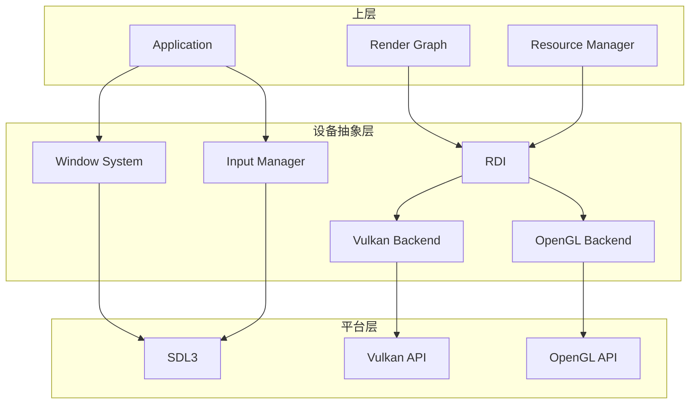
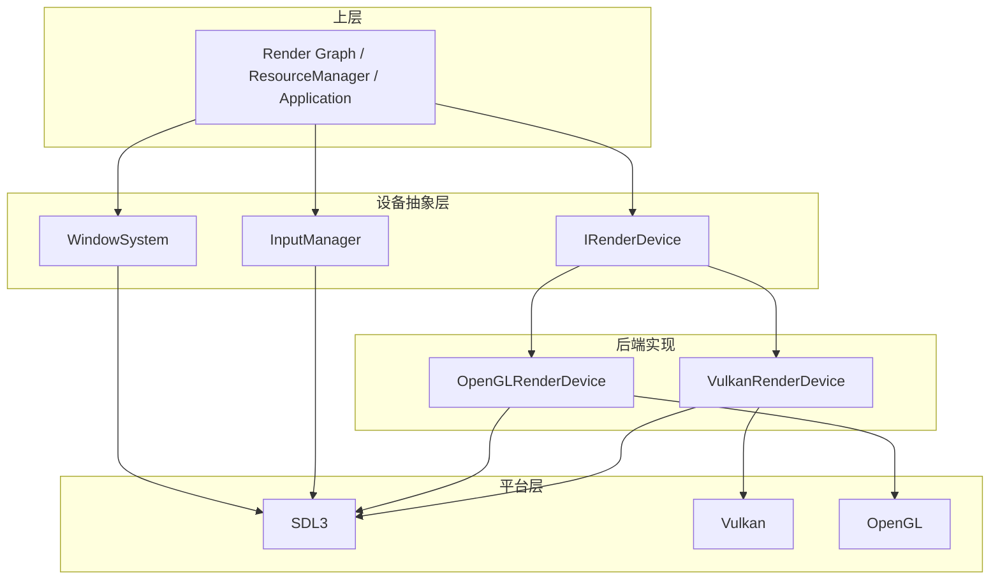
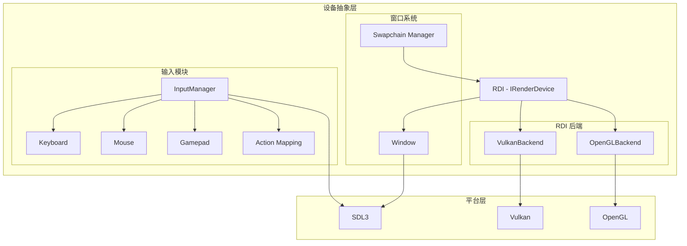

# 设备抽象层设计文档

> 本文档与 [rendering_engine_design.md](./rendering_engine_design.md) 设计对齐，设备抽象层为渲染管线、资源管理等上层提供统一的设备访问接口。与 [executor_layer_design.md](./executor_layer_design.md) 协作：多线程命令录制时 executor 调度任务，设备层提供每线程 CommandList。

## 目录
1. [概述与目标](#概述与目标)
2. [问题分析](#问题分析)
3. [设计原则](#设计原则)
4. [架构设计](#架构设计)
5. [核心组件设计](#核心组件设计)
6. [关键接口设计](#关键接口设计)
7. [错误处理与生命周期](#错误处理与生命周期)
8. [与上层集成](#与上层集成)
9. [实现路线图](#实现路线图)

---

## 概述与目标

### 1.1 背景

在 Vulkan+SDL3 渲染引擎架构中，**设备抽象层 (Device Abstraction Layer)** 位于平台层之上，为上层（渲染管线、资源管理、场景管理等）提供统一的设备访问接口。该层负责：

- **渲染设备抽象**：通过 RDI (Rendering Device Interface) 屏蔽 Vulkan / OpenGL 差异，提供统一的资源创建、命令录制、同步机制
- **窗口系统**：管理 SDL3 窗口、Swapchain 创建与呈现
- **输入设备**：统一键盘、鼠标、手柄的输入抽象，支持动作映射（Action Mapping）

设备抽象层是上层与底层平台（SDL3、Vulkan API、OpenGL API）之间的**唯一桥梁**，所有平台相关代码均集中于此层。

### 1.2 设计目标

1. **后端可替换**：RDI 支持 Vulkan、OpenGL 等后端，可在运行时或编译时切换
2. **平台无关**：通过 SDL3 抽象窗口与输入，实现跨平台（Windows、Linux、macOS）
3. **与渲染管线适配**：支持多线程命令录制、帧流水线（Fence/Semaphore）、Render Graph 依赖
4. **资源生命周期清晰**：句柄化资源管理，避免跨层悬空引用
5. **高性能**：避免不必要的抽象开销，关键路径直接映射到原生 API

### 1.3 适用范围

- 渲染引擎中所有需要访问 GPU、窗口、输入设备的模块
- 资源管理层（Staging Memory Manager 与 RDI 交互）
- 渲染管线层（Render Graph 通过 RDI 录制命令）
- 应用层（通过 InputManager 获取输入）

---

## 问题分析

### 2.1 跨后端差异

| 维度 | Vulkan | OpenGL | 抽象策略 |
|------|--------|--------|----------|
| 命令录制 | 显式 Command Buffer | 隐式立即模式 | RDI 封装 CommandList，OpenGL 实现缓存命令队列 |
| 多线程 | 每线程独立 CommandPool | 单线程上下文 | 多线程录制时 OpenGL 退化为串行 |
| 资源绑定 | Descriptor Set | 绑定槽位 | 统一 DescriptorSet 语义，OpenGL 映射到纹理单元 |
| 同步 | Fence、Semaphore | glFinish、glSync | 统一 Fence/Semaphore 句柄 |
| 内存 | VMA / 显式分配 | 驱动管理 | RDI 统一 Buffer/Texture 语义 |

### 2.2 窗口与渲染上下文

- **SDL3**: 负责窗口创建、事件循环、输入轮询；需与 Vulkan Surface / OpenGL Context 正确关联
- **Swapchain**：Vulkan 需显式创建；OpenGL 由窗口系统隐式提供
- **尺寸变化**：窗口 resize 时需重建 Swapchain 或调整视口

### 2.3 输入抽象

- **原始输入**：按键、鼠标、手柄轴/按钮的底层状态
- **动作映射**：同一 action 可绑定多个输入（如 "MoveForward" 对应 W 和上箭头）
- **手柄热插拔**：SDL3 支持，需在 InputManager 中维护连接状态

### 2.4 设备抽象层典型数据流



---

## 设计原则

### 3.1 核心原则

1. **接口抽象**：RDI 定义纯虚接口，不暴露实现细节；上层仅依赖接口
2. **句柄化资源**：Buffer、Texture、Pipeline 等通过句柄引用，避免跨层传递裸指针
3. **单线程录制假设**：OpenGL 无多线程录制，ParallelRecordCommands 时退化为串行；Vulkan 每线程独立 CommandPool
4. **帧流水线**：Fence 关联帧边界，避免每帧 WaitIdle；Acquire 与 Present 语义与上层一致
5. **平台依赖下沉**：SDL3、Vulkan、OpenGL 等仅在设备抽象层内引用，上层无平台头文件

### 3.2 分层设计



---

## 架构设计

### 4.1 组件关系图



### 4.2 初始化顺序

```
1. SDL_Init()
2. 创建 Window (SDL3)
3. 创建 RenderDevice (需 window handle)
   - Vulkan: 创建 Instance → Surface → Device → Swapchain
   - OpenGL: 创建 GL Context → 绑定 SDL 窗口
4. 创建 InputManager (需 window)
5. 主循环：Input → Update → Render → Present
```

---

## 核心组件设计

### 5.1 渲染设备接口 (RDI)

RDI 是设备抽象层的核心，提供与 GPU 交互的完整抽象。

#### 5.1.1 资源句柄类型

```cpp
template<typename T>
struct Handle {
    uint64_t id = 0;
    
    bool IsValid() const { return id != 0; }
    bool operator==(const Handle& other) const { return id == other.id; }
    bool operator!=(const Handle& other) const { return id != other.id; }
};

using BufferHandle = Handle<struct Buffer_Tag>;
using TextureHandle = Handle<struct Texture_Tag>;
using ShaderHandle = Handle<struct Shader_Tag>;
using PipelineHandle = Handle<struct Pipeline_Tag>;
using DescriptorSetHandle = Handle<struct DescriptorSet_Tag>;
using FenceHandle = Handle<struct Fence_Tag>;
using SemaphoreHandle = Handle<struct Semaphore_Tag>;
```

#### 5.1.2 资源描述符

```cpp
enum class Format {
    Undefined,
    R8_UNORM, RG8_UNORM, RGBA8_UNORM, RGBA8_SRGB,
    R16F, RG16F, RGBA16F,
    R32F, RG32F, RGB32F, RGBA32F,
    D16, D24, D32, D24S8, D32S8,
    BC1, BC3, BC5, BC7,
};

enum class BufferUsage {
    Vertex      = 1 << 0,
    Index       = 1 << 1,
    Uniform     = 1 << 2,
    Storage     = 1 << 3,
    Transfer    = 1 << 4,
};

enum class TextureUsage {
    Sampled         = 1 << 0,
    Storage         = 1 << 1,
    ColorAttachment = 1 << 2,
    DepthAttachment = 1 << 3,
    Transfer        = 1 << 4,
};

struct BufferDesc {
    size_t size;
    BufferUsage usage;
    bool cpuVisible = false;
};

struct TextureDesc {
    uint32_t width;
    uint32_t height;
    uint32_t depth = 1;
    uint32_t mipLevels = 1;
    uint32_t arrayLayers = 1;
    Format format;
    TextureUsage usage;
    bool isCube = false;
};

enum class ShaderStage {
    Vertex, Fragment, Compute, Geometry, TessControl, TessEvaluation,
};

enum class PrimitiveTopology {
    TriangleList, TriangleStrip, LineList, PointList,
};

enum class CompareOp {
    Never, Less, Equal, LessOrEqual, Greater, NotEqual, GreaterOrEqual, Always,
};

enum class BlendFactor {
    Zero, One, SrcColor, OneMinusSrcColor, DstColor, OneMinusDstColor,
    SrcAlpha, OneMinusSrcAlpha, DstAlpha, OneMinusDstAlpha,
};

enum class BlendOp {
    Add, Subtract, ReverseSubtract, Min, Max,
};

struct ShaderDesc {
    ShaderStage stage;
    std::vector<uint8_t> code;  // SPIR-V or GLSL
    std::string entryPoint = "main";
};

enum class DescriptorType {
    UniformBuffer, SampledImage, Sampler, StorageBuffer, StorageImage,
};

struct DescriptorBinding {
    uint32_t binding;
    DescriptorType type;
    ShaderStage visibility;
    uint32_t count = 1;
};

struct DescriptorSetLayoutDesc {
    std::vector<DescriptorBinding> bindings;
};

struct BlendState {
    bool blendEnable = false;
    BlendFactor srcColorBlendFactor = BlendFactor::One;
    BlendFactor dstColorBlendFactor = BlendFactor::Zero;
    BlendOp colorBlendOp = BlendOp::Add;
    // ...
};

struct DepthStencilState {
    bool depthTestEnable = true;
    bool depthWriteEnable = true;
    CompareOp depthCompareOp = CompareOp::Less;
    bool stencilTestEnable = false;
};

struct RasterizationState {
    bool cullEnable = true;
    bool frontFaceCCW = true;
    float lineWidth = 1.0f;
};

struct VertexInputBinding {
    uint32_t binding;
    uint32_t stride;
    bool perInstance = false;
};

struct VertexInputAttribute {
    uint32_t location;
    uint32_t binding;
    Format format;
    uint32_t offset;
};
```

#### 5.1.3 管线状态

```cpp
struct PipelineDesc {
    std::vector<ShaderHandle> shaders;
    std::vector<VertexInputBinding> vertexBindings;
    std::vector<VertexInputAttribute> vertexAttributes;
    PrimitiveTopology topology = PrimitiveTopology::TriangleList;
    RasterizationState rasterization;
    DepthStencilState depthStencil;
    std::vector<BlendState> blendStates;
    std::vector<Format> colorAttachmentFormats;
    Format depthAttachmentFormat = Format::Undefined;
};
```

#### 5.1.4 IRenderDevice 接口

```cpp
class IRenderDevice {
public:
    virtual ~IRenderDevice() = default;
    
    // 设备管理
    virtual bool Initialize(const DeviceConfig& config) = 0;
    virtual void Shutdown() = 0;
    
    // 资源创建
    virtual BufferHandle CreateBuffer(const BufferDesc& desc, const void* data = nullptr) = 0;
    virtual TextureHandle CreateTexture(const TextureDesc& desc, const void* data = nullptr) = 0;
    virtual ShaderHandle CreateShader(const ShaderDesc& desc) = 0;
    virtual PipelineHandle CreatePipeline(const PipelineDesc& desc) = 0;
    virtual DescriptorSetHandle CreateDescriptorSet(const DescriptorSetLayoutDesc& layout) = 0;
    
    // 资源销毁
    virtual void DestroyBuffer(BufferHandle handle) = 0;
    virtual void DestroyTexture(TextureHandle handle) = 0;
    virtual void DestroyShader(ShaderHandle handle) = 0;
    virtual void DestroyPipeline(PipelineHandle handle) = 0;
    virtual void DestroyDescriptorSet(DescriptorSetHandle handle) = 0;
    
    // 资源更新
    virtual void UpdateBuffer(BufferHandle handle, const void* data, size_t size, size_t offset = 0) = 0;
    virtual void UpdateTexture(TextureHandle handle, const void* data, uint32_t mipLevel = 0) = 0;
    
    // 命令录制：BeginCommandList(threadIndex) 用于多线程录制，每线程独立 CommandPool
    virtual CommandList* BeginCommandList(uint32_t threadIndex = 0) = 0;
    virtual void EndCommandList(CommandList* cmd) = 0;
    virtual void Submit(const std::vector<CommandList*>& cmdLists,
                       const std::vector<SemaphoreHandle>& waitSemaphores = {},
                       const std::vector<SemaphoreHandle>& signalSemaphores = {},
                       FenceHandle fence = {}) = 0;
    
    // 同步
    virtual void WaitIdle() = 0;
    virtual FenceHandle CreateFence(bool signaled = false) = 0;
    virtual void WaitForFence(FenceHandle fence, uint64_t timeout = UINT64_MAX) = 0;
    virtual void ResetFence(FenceHandle fence) = 0;
    virtual SemaphoreHandle CreateSemaphore() = 0;
    
    // 交换链
    virtual uint32_t AcquireNextImage() = 0;  // 返回 back buffer index，内部 signal semaphore
    virtual void Present() = 0;
    virtual TextureHandle GetBackBuffer() = 0;
    virtual uint32_t GetCurrentFrameIndex() const = 0;
    
    // 查询
    virtual const DeviceCapabilities& GetCapabilities() const = 0;
};

struct DeviceConfig {
    void* windowHandle;
    uint32_t width;
    uint32_t height;
    bool enableValidation = false;
    bool vsync = true;
    uint32_t backBufferCount = 3;
};

struct DeviceCapabilities {
    uint32_t maxTextureSize;
    uint32_t maxComputeWorkGroupSize[3];
    bool supportsGeometryShader;
    bool supportsTessellation;
    bool supportsComputeShader;
    bool supportsRayTracing;
};
```

#### 5.1.5 CommandList 接口

```cpp
class CommandList {
public:
    virtual ~CommandList() = default;
    
    // Render Pass
    virtual void BeginRenderPass(const std::vector<TextureHandle>& colorAttachments,
                                 TextureHandle depthAttachment = {}) = 0;
    virtual void EndRenderPass() = 0;
    
    // Pipeline Binding
    virtual void BindPipeline(PipelineHandle pipeline) = 0;
    virtual void BindDescriptorSet(uint32_t set, DescriptorSetHandle descriptorSet) = 0;
    
    // Resource Binding
    virtual void BindVertexBuffer(uint32_t binding, BufferHandle buffer, size_t offset = 0) = 0;
    virtual void BindIndexBuffer(BufferHandle buffer, size_t offset = 0, bool is16Bit = false) = 0;
    
    // Push Constants
    virtual void SetPushConstants(const void* data, size_t size, size_t offset = 0) = 0;
    
    // Draw Commands
    virtual void Draw(uint32_t vertexCount, uint32_t instanceCount = 1,
                     uint32_t firstVertex = 0, uint32_t firstInstance = 0) = 0;
    virtual void DrawIndexed(uint32_t indexCount, uint32_t instanceCount = 1,
                            uint32_t firstIndex = 0, int32_t vertexOffset = 0,
                            uint32_t firstInstance = 0) = 0;
    
    // Compute
    virtual void Dispatch(uint32_t groupCountX, uint32_t groupCountY, uint32_t groupCountZ) = 0;
    
    // Resource Barriers
    virtual void Barrier(const std::vector<TextureHandle>& textures) = 0;
    
    // Clear / Viewport / Scissor
    virtual void ClearColor(TextureHandle texture, const float color[4]) = 0;
    virtual void ClearDepth(TextureHandle texture, float depth, uint8_t stencil = 0) = 0;
    virtual void SetViewport(float x, float y, float width, float height,
                            float minDepth = 0.0f, float maxDepth = 1.0f) = 0;
    virtual void SetScissor(int32_t x, int32_t y, uint32_t width, uint32_t height) = 0;
};
```

### 5.2 Vulkan 后端

```cpp
class VulkanRenderDevice : public IRenderDevice {
public:
    bool Initialize(const DeviceConfig& config) override;
    void Shutdown() override;
    
    // 资源创建：直接映射到 VkBuffer/VkImage/VkShaderModule/VkPipeline
    BufferHandle CreateBuffer(const BufferDesc& desc, const void* data = nullptr) override;
    // ...
    
    // 命令录制：BeginCommandList(threadIndex) 从 threadIndex 对应的 CommandPool 分配 CommandBuffer
    CommandList* BeginCommandList(uint32_t threadIndex = 0) override;
    void EndCommandList(CommandList* cmd) override;
    void Submit(const std::vector<CommandList*>& cmdLists, ...) override;
    
private:
    VkInstance instance_;
    VkDevice device_;
    VkPhysicalDevice physicalDevice_;
    VmaAllocator allocator_;
    std::vector<VkCommandPool> commandPools_;  // 每线程一个
    VkSwapchainKHR swapchain_;
    std::vector<VkCommandBuffer> commandBuffers_;
    // ...
};
```

**实现要点**：
- 使用 VMA (Vulkan Memory Allocator) 管理 GPU 内存
- 多线程录制：每线程独立 CommandPool，Submit 时按拓扑序合并
- 帧流水线：每帧对应 Fence， Acquire 时 signal semaphore，Submit 时 wait/signal
- Validation Layer：`enableValidation` 时启用

### 5.3 OpenGL 后端

```cpp
class OpenGLRenderDevice : public IRenderDevice {
public:
    bool Initialize(const DeviceConfig& config) override;
    void Shutdown() override;
    
    // 命令录制：OpenGL 无显式 Command Buffer，需维护命令队列
    // BeginCommandList 时分配可录制对象；EndCommandList 时缓存命令；
    // Submit 时按序执行。ParallelRecordCommands 退化为单线程串行。
    CommandList* BeginCommandList(uint32_t threadIndex = 0) override;
    void EndCommandList(CommandList* cmd) override;
    void Submit(const std::vector<CommandList*>& cmdLists, ...) override;
    
private:
    SDL_GLContext context_;
    std::vector<GLCommand> commandQueue_;  // 命令队列
    // State cache 减少冗余 GL 调用
};
```

**实现要点**：
- 命令队列：将 CommandList 操作序列化为 GL 调用，Submit 时按序执行
- 无多线程录制：`threadIndex` 忽略，多线程时串行
- 状态缓存：减少重复的 glBindTexture、glUseProgram 等调用

### 5.4 窗口系统

```cpp
class WindowSystem {
public:
    // 创建窗口（SDL3）
    bool Create(const WindowConfig& config);
    void Destroy();
    
    SDL_Window* GetWindow() const { return window_; }
    void* GetNativeHandle() const;  // 供 Vulkan Surface / OpenGL Context 使用
    
    uint32_t GetWidth() const;
    uint32_t GetHeight() const;
    void Resize(uint32_t width, uint32_t height);
    
    bool PollEvents();  // 返回 false 表示应退出
    bool ShouldClose() const;
    
private:
    SDL_Window* window_ = nullptr;
};

struct WindowConfig {
    uint32_t width = 1920;
    uint32_t height = 1080;
    std::string title = "Game";
    bool fullscreen = false;
    bool resizable = true;
};
```

**与 Swapchain 的关系**：
- Vulkan：WindowSystem 提供 `GetNativeHandle()`，RDI 创建 VulkanSurface 时使用
- Swapchain 由 RDI 内部管理，尺寸变化时重建
- OpenGL：WindowSystem 创建后，RDI 创建 GL Context 并绑定

### 5.5 输入设备模块

```cpp
#include <variant>

class InputManager {
public:
    void Initialize(SDL_Window* window);
    void Update();  // 每帧调用，轮询 SDL 事件并更新状态
    
    // 键盘
    bool IsKeyPressed(KeyCode key) const;
    bool IsKeyJustPressed(KeyCode key) const;
    bool IsKeyJustReleased(KeyCode key) const;
    
    // 鼠标
    glm::vec2 GetMousePosition() const;
    glm::vec2 GetMouseDelta() const;
    bool IsMouseButtonPressed(MouseButton button) const;
    float GetMouseWheelDelta() const;
    
    // 手柄
    bool IsGamepadConnected(int index) const;
    float GetGamepadAxis(int index, GamepadAxis axis) const;
    bool IsGamepadButtonPressed(int index, GamepadButton button) const;
    
    // 动作映射
    void AddActionBinding(const std::string& action, const InputBinding& binding);
    void ClearActionBindings(const std::string& action);
    bool IsActionTriggered(const std::string& action) const;
    float GetActionValue(const std::string& action) const;
    
    // 事件回调
    void RegisterCallback(InputEventType type, std::function<void(const InputEvent&)> callback);
};

struct GamepadBinding {
    int gamepadIndex;
    std::variant<GamepadButton, GamepadAxis> input;
};

using InputBinding = std::variant<KeyCode, MouseButton, GamepadBinding>;

// 便捷构造
inline InputBinding Keyboard(KeyCode key) { return key; }
inline InputBinding Mouse(MouseButton btn) { return btn; }
inline InputBinding GamepadButton(int idx, GamepadButton button) {
    return GamepadBinding{idx, std::variant<GamepadButton, GamepadAxis>(button)};
}
inline InputBinding GamepadAxis(int idx, GamepadAxis axisValue) {
    return GamepadBinding{idx, std::variant<GamepadButton, GamepadAxis>(axisValue)};
}
```

**输入状态管理**：
- 双缓冲：当前帧与上一帧状态，用于 `JustPressed`/`JustReleased` 判断
- 动作映射：`AddActionBinding` 可多次调用，同一 action 多绑定

---

## 关键接口设计

### 6.1 设备创建工厂

```cpp
std::unique_ptr<IRenderDevice> CreateRenderDevice(Backend backend) {
    switch (backend) {
        case Backend::Vulkan: return std::make_unique<VulkanRenderDevice>();
        case Backend::OpenGL: return std::make_unique<OpenGLRenderDevice>();
        default: return nullptr;
    }
}
```

### 6.2 帧流水线流程

```cpp
// 每帧 Execute 流程（由 Render Graph 驱动）
void RenderGraph::Execute(IRenderDevice* device) {
    device->WaitForFence(frameFences_[currentFrameIndex_]);
    device->ResetFence(frameFences_[currentFrameIndex_]);
    
    uint32_t imageIndex = device->AcquireNextImage();
    
    // 构建绘制列表、录制命令...
    std::vector<CommandList*> cmdLists = RecordPasses(device);
    
    device->Submit(cmdLists,
                  {acquireSemaphore_},
                  {renderCompleteSemaphore_},
                  frameFences_[currentFrameIndex_]);
    
    device->Present();
    
    currentFrameIndex_ = (currentFrameIndex_ + 1) % kMaxFramesInFlight;
}
```

### 6.3 多线程命令录制

```cpp
// RenderTaskScheduler 调用
void RenderTaskScheduler::ParallelRecordCommands(const std::vector<RenderPass*>& passes) {
    // 按 DAG 拓扑序分组，无依赖的 Pass 并行录制
    for (auto& group : TopologicalGroups(passes)) {
        std::vector<std::future<CommandList*>> futures;
        for (size_t i = 0; i < group.size(); ++i) {
            futures.push_back(executor_.submit([&, i]() {
                auto* cmd = device_->BeginCommandList(static_cast<uint32_t>(i));
                group[i]->Execute(*cmd);
                device_->EndCommandList(cmd);
                return cmd;
            }));
        }
        for (auto& f : futures) {
            recordedLists_.push_back(f.get());
        }
    }
}
```

---

## 错误处理与生命周期

### 7.1 初始化失败

- `IRenderDevice::Initialize()` 返回 `false`，`GetLastError()` 返回详细原因
- 调用方负责不继续调用其他接口，必要时调用 `Shutdown()` 清理
- 与 `RenderEngine::Initialize()` 策略一致：失败返回 false，`GetLastError()` 获取原因

### 7.2 资源生命周期

- 句柄无效：`Handle::IsValid()` 返回 false 时，调用方不得使用
- 销毁顺序：先销毁依赖资源的资源（如 Pipeline 依赖 Shader），再销毁底层资源
- 帧内资源：DescriptorSet 实例级由 Material 池化，帧末 `ReleaseAllInstanceDescriptorSets()`

### 7.3 窗口与 Swapchain 重建

- 窗口 resize：`WindowSystem::Resize()` 通知上层；RDI 在下次 `AcquireNextImage` 或 `Present` 时检测 VK_ERROR_OUT_OF_DATE_KHR，重建 Swapchain
- 最小化：可暂停 Present 或使用空帧，避免无效渲染

---

## 与上层集成

### 8.1 RenderEngine 初始化

```cpp
bool RenderEngine::Initialize(const Config& config) {
    SDL_Init(SDL_INIT_VIDEO | SDL_INIT_GAMEPAD);
    
    windowSystem_ = std::make_unique<WindowSystem>();
    windowSystem_->Create({config.width, config.height, config.title, config.fullscreen});
    
    renderDevice_ = CreateRenderDevice(config.backend);
    DeviceConfig devConfig = {
        windowSystem_->GetNativeHandle(),
        config.width, config.height,
        config.enableValidation, config.vsync, 3
    };
    if (!renderDevice_->Initialize(devConfig)) {
        lastError_ = renderDevice_->GetLastError();
        return false;
    }
    
    inputManager_ = std::make_unique<InputManager>();
    inputManager_->Initialize(windowSystem_->GetWindow());
    
    // ...
}
```

### 8.2 主循环

```cpp
void RenderEngine::Run(Application* app) {
    while (!windowSystem_->ShouldClose()) {
        inputManager_->Update();
        windowSystem_->PollEvents();
        
        entityManager_->Update(deltaTime);
        sceneManager_->Update(deltaTime);
        app->OnUpdate(deltaTime);
        app->OnRender();  // 内部调用 RenderGraph::Execute
        
        renderDevice_->Present();
    }
}
```

### 8.3 依赖关系

| 上层模块 | 依赖设备抽象层 |
|----------|----------------|
| Render Graph | IRenderDevice |
| Resource Manager | IRenderDevice（Buffer/Texture 创建） |
| Staging Memory Manager | IRenderDevice（Upload Queue） |
| Application | InputManager, WindowSystem |

---

## 实现路线图

### Phase 1：基础框架（2–3 周）
- [ ] SDL3 窗口创建与事件循环
- [ ] Vulkan Instance、Device、Surface 基础
- [ ] 简单 Swapchain 与三角形渲染
- [ ] 输入系统基础（键盘、鼠标）

### Phase 2：RDI 完整实现（2–3 周）
- [ ] 实现完整 IRenderDevice 接口
- [ ] Vulkan Backend：Buffer、Texture、Shader、Pipeline
- [ ] CommandList 与 Vulkan Command Buffer 映射
- [ ] Fence、Semaphore 同步
- [ ] VMA 集成

### Phase 3：OpenGL 后端（1–2 周）
- [ ] OpenGL Backend 基础实现
- [ ] 命令队列序列化 GL 调用
- [ ] 状态缓存
- [ ] 与 RDI 接口对齐

### Phase 4：窗口与输入完善（1 周）
- [ ] 窗口 resize 与 Swapchain 重建
- [ ] 手柄支持与 Action Mapping
- [ ] 输入事件回调

### Phase 5：多线程与优化（1–2 周）
- [ ] Vulkan 多线程 CommandPool
- [ ] DescriptorSet 池化
- [ ] 性能测试与调优

---

## 附录：与平台层的关系

### A.1 SDL3 用法

- `SDL_Init(SDL_INIT_VIDEO | SDL_INIT_GAMEPAD | SDL_INIT_EVENTS)`
- `SDL_CreateWindow` → `SDL_Window*`
- Vulkan: `SDL_Vulkan_CreateSurface(window, instance, &surface)`
- OpenGL: `SDL_GL_CreateContext(window)`
- 输入: `SDL_PollEvent`, `SDL_GetKeyboardState`, `SDL_GetMouseState`, `SDL_GameController`

### A.2 技术栈

- **SDL3**: 窗口、输入、事件
- **Vulkan**: 现代图形 API
- **VMA**: Vulkan 内存分配
- **OpenGL**: 可选后端

---

## 总结

设备抽象层是渲染引擎中连接上层逻辑与底层平台的**桥梁**，主要包含：

1. **RDI**：统一的渲染设备接口，支持 Vulkan / OpenGL 后端
2. **WindowSystem**：基于 SDL3 的窗口管理
3. **InputManager**：键盘、鼠标、手柄的输入抽象与动作映射

通过**接口抽象、句柄化资源、帧流水线**等设计，实现后端可替换、平台无关、与渲染管线无缝对接的目标。
