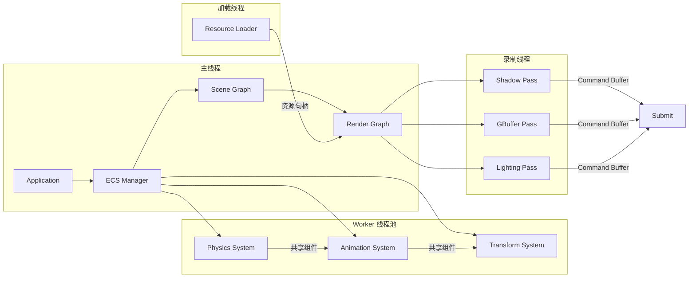
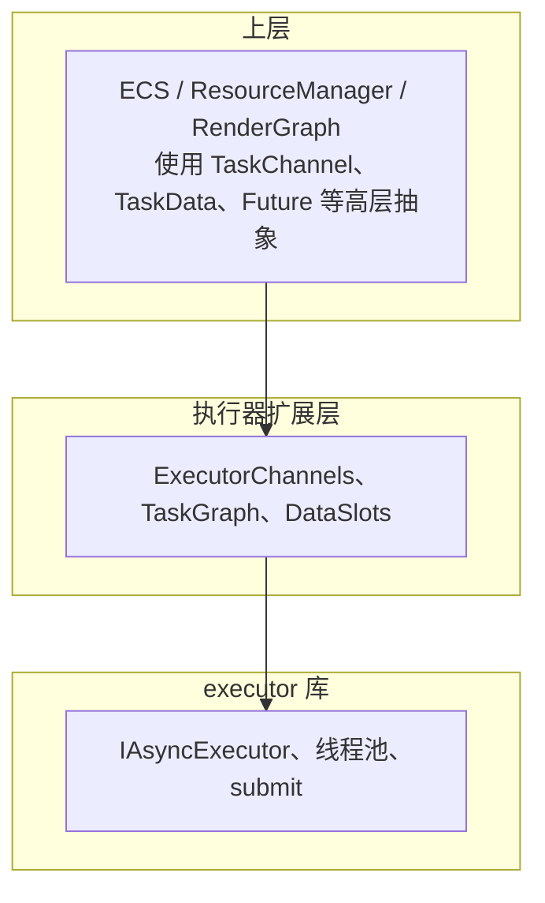
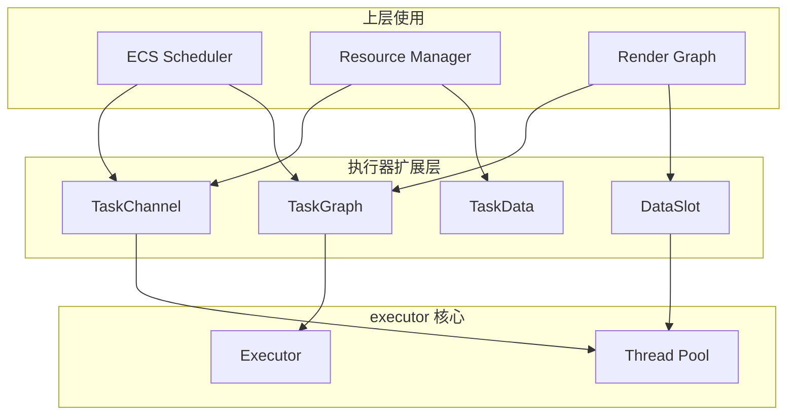

# 底层执行器层设计文档：线程间数据通信方案

## 目录
1. [概述与目标](#概述与目标)
2. [问题分析](#问题分析)
3. [设计原则](#设计原则)
4. [架构设计](#架构设计)
5. [核心组件设计](#核心组件设计)
6. [通信原语与 API](#通信原语与-api)
7. [与渲染引擎集成](#与渲染引擎集成)
8. [实现路线图](#实现路线图)

---

## 概述与目标

### 1.1 背景

在 Vulkan+SDL3 渲染引擎架构中，**底层执行器层 (Executor Layer)** 负责：
- 并行执行 ECS 系统（System Scheduler → executor）
- 异步资源加载（Resource Loader → executor）
- 并行命令录制（Render Passes → executor 多线程录制）
- 任务图调度（Task Graph，依赖关系管理）

上述场景均涉及**多线程间的数据传递**：
- 资源加载线程将加载完成的资源传入主线程/渲染线程
- 并行 ECS 系统间共享组件数据
- 并行录制的 Command Buffer 需汇总后提交
- 任务依赖产生的生产者-消费者数据流

### 1.2 设计目标

1. **无死锁**：避免因锁顺序、循环等待导致的死锁
2. **无数据竞争**：保证对共享数据的访问符合内存模型，无未定义行为
3. **基于 executor**：在 executor 库之上扩展，不修改其核心实现
4. **底层执行器层完成**：通信能力作为执行器层的一部分，对上层透明或提供简洁抽象
5. **高性能**：最小化同步开销，支持无锁/低锁路径

### 1.3 适用范围

- 渲染引擎中所有依赖 executor 的模块（ECS、资源管理、Render Graph）
- 任意需要跨线程数据传递的引擎子系统

---

## 问题分析

### 2.1 死锁成因与规避

| 成因 | 场景示例 | 规避策略 |
|------|----------|----------|
| 循环等待 | 线程 A 持锁 1 等锁 2，线程 B 持锁 2 等锁 1 | 统一锁顺序；任务依赖 DAG 化 |
| 嵌套锁 | 任务回调内再次提交任务并等待 | 避免在任务内同步等待同级/子任务；使用异步回调 |
| 资源竞争 | 多线程争抢同一资源句柄 | 所有权转移代替共享；每线程独立资源 |
| 优先级反转 | 低优先级任务持锁，高优先级任务等待 | 尽量减少锁持有时间；使用无锁结构 |

### 2.2 数据竞争成因与规避

| 成因 | 场景示例 | 规避策略 |
|------|----------|----------|
| 共享可变状态 | 多线程同时写同一缓存 | 单写者原则；双缓冲/三缓冲 |
| 可见性 | 线程 A 写入，线程 B 未看到 | 原子操作或显式内存屏障 |
| 生命周期 | 线程 A 释放对象，线程 B 仍在使用 | 引用计数/RAII；显式同步点 |
| 迭代器失效 | 遍历时另一线程修改容器 | 拷贝或快照；不可变视图 |

### 2.3 渲染引擎典型数据流



---

## 设计原则

### 3.1 核心原则

1. **消息传递优于共享内存**：通过 Channel、Future 等显式传递数据，减少共享可变状态
2. **单写者原则**：每个数据单元同一时刻最多一个写者；多读者可共享不可变数据
3. **所有权明确**：数据在任务间传递时，所有权发生转移，避免悬空引用
4. **任务依赖 DAG**：依赖关系构成有向无环图，避免循环依赖导致的死锁
5. **最小化临界区**：临界区仅保护必要操作，尽快释放锁

### 3.2 分层设计



---

## 架构设计

### 4.1 组件关系图



### 4.2 典型通信模式

| 模式 | 描述 | 适用场景 | 实现 |
|------|------|----------|------|
| **One-Shot** | 生产者产生一次结果，消费者获取 | 异步资源加载 | `std::future` / `Promise` |
| **Stream** | 生产者持续产生，消费者持续消费 | 实时数据流 | SPSC/MPSC Channel |
| **Broadcast** | 一份数据多消费者 | 场景数据分发给多个 Pass | 共享只读句柄 / Copy |
| **Scatter-Gather** | 多生产者，单消费者汇总 | 并行录制 Command Buffer | 每线程独立输出 + Barrier |
| **Pipeline** | 数据顺序经过多个阶段 | 渲染管线 Pass 链 | 依赖图 + 数据槽 |

---

## 核心组件设计

### 5.1 TaskChannel：无锁消息通道

**用途**：单生产者单消费者 (SPSC) 或 多生产者单消费者 (MPSC) 的无锁队列，用于任务间传递消息。

**设计要点**：
- 基于 `std::atomic` 和 CAS 实现，避免互斥锁
- 固定容量环形缓冲区，避免动态分配
- 支持 `try_send` / `try_recv` 非阻塞，以及 `send` / `recv` 阻塞（可选）

```cpp
// 概念接口
template<typename T, size_t Capacity = 64>
class TaskChannel {
public:
    // 非阻塞发送，队列满返回 false
    bool try_send(T&& value);
    
    // 非阻塞接收，队列空返回 false
    bool try_recv(T& out);
    
    // 阻塞发送（带超时），用于必要时
    bool send(T&& value, std::chrono::milliseconds timeout = {});
    
    // 阻塞接收（带超时）
    bool recv(T& out, std::chrono::milliseconds timeout = {});
    
    size_t size() const;
    bool empty() const;
};
```

**死锁/竞争规避**：
- 无锁实现，无锁顺序问题
- 单消费者保证接收顺序，无竞争

### 5.2 TaskData / DataSlot：任务数据槽

**用途**：为任务图节点提供输入/输出数据槽，由执行器管理生命周期，避免跨任务悬空引用。

**设计要点**：
- 每个任务节点声明输入槽（只读）和输出槽（独占写）
- 依赖边隐含数据流：A 的输出槽 → B 的输入槽
- 槽在任务完成后由执行器回收或复用

```cpp
// 数据槽句柄（不直接持有数据，避免复制）
struct DataSlotHandle {
    uint64_t id;
    uint32_t generation;
};

// 任务数据槽管理器（执行器内部）
class TaskDataManager {
public:
    DataSlotHandle allocate_slot(size_t size_bytes);
    void* get_slot(DataSlotHandle h);
    void release_slot(DataSlotHandle h);
    
    // 绑定依赖：task_b 的 input_slot 引用 task_a 的 output_slot
    void bind_dependency(TaskHandle a, DataSlotHandle a_out,
                         TaskHandle b, DataSlotHandle b_in);
};
```

**竞争规避**：
- 输入槽在任务开始前由执行器填充，任务执行期间只读
- 输出槽在任务执行期间独占写入，完成后生效
- 依赖保证 A 完成后 B 才读取，无并发读写

### 5.3 TaskGraph：带数据依赖的任务图

**用途**：在 executor 的 submit 之上，构建 DAG 任务图，自动处理依赖与数据传递。

**设计要点**：
- 节点为闭包或 `std::function`，可接收 `DataSlotHandle` 作为输入
- 边表示依赖，执行器按拓扑序调度，无循环
- 与 `std::future` 结合：子任务返回值通过 future 传递

```cpp
class TaskGraph {
public:
    using TaskFunc = std::function<void(const TaskContext&)>;
    
    // 添加任务节点
    TaskHandle add_task(TaskFunc func,
                        std::vector<TaskHandle> dependencies = {});
    
    // 添加带数据依赖的任务（output 传递给 dependents）
    TaskHandle add_task_with_data(TaskFunc func,
                                  std::vector<TaskHandle> deps,
                                  std::vector<TaskHandle> dependents);
    
    // 提交到 executor 执行
    void submit(Executor& ex);
    
    // 等待所有任务完成
    void wait();
};
```

**死锁规避**：
- DAG 结构保证无循环依赖
- 任务不显式等待其他任务，由调度器按依赖顺序执行

### 5.4 ExecutorPromise / ExecutorFuture：执行器增强 Future

**用途**：在 `std::future` 基础上，支持与 executor 任务绑定，避免阻塞调用线程。

**设计要点**：
- `ExecutorPromise<T>`：在任务内 set_value，可跨线程安全
- `ExecutorFuture<T>`：可 `then(executor, callback)` 在 executor 中续接，避免阻塞
- 实现基于 `std::promise`/`std::future`，保证标准内存序

```cpp
template<typename T>
class ExecutorPromise {
public:
    void set_value(T value);
    void set_exception(std::exception_ptr e);
    ExecutorFuture<T> get_future();
};

template<typename T>
class ExecutorFuture {
public:
    T get();  // 阻塞直到就绪
    bool valid() const;
    
    // 在 executor 中续接，不阻塞当前线程
    template<typename F>
    ExecutorFuture<std::invoke_result_t<F, T>> then(Executor& ex, F&& func);
};
```

**竞争规避**：
- `promise::set_value` 仅调用一次，标准库保证线程安全
- `future::get` 仅调用一次，由调用者保证

### 5.5 FrameData：帧作用域数据

**用途**：每帧分配、帧末释放的数据，用于渲染管线中大量短期数据（如可见物体列表、绘制命令等）。

**设计要点**：
- 双缓冲或三缓冲：当前帧写入，上一帧只读
- 帧边界同步：主线程在帧末 swap 缓冲区，worker 任务使用稳定快照

```cpp
template<typename T>
class FrameData {
public:
    // 获取当前写入缓冲区
    T& write_buffer();
    
    // 获取当前只读快照（上一帧或当前已提交）
    const T& read_buffer() const;
    
    // 帧末调用，交换缓冲区
    void end_frame();
};
```

**竞争规避**：
- 写入与读取发生在不同缓冲区
- `end_frame` 使用原子或简短临界区交换指针

### 5.6 双缓冲 / 三缓冲辅助

**用途**：生产者持续写入，消费者读取上一帧完整快照，无需锁保护读写。

```cpp
template<typename T, size_t N = 2>
class SwapBuffer {
public:
    T& current_for_writer();
    const T& current_for_reader() const;
    void swap();  // 由单一协调者调用
};
```

---

## 通信原语与 API

### 6.1 执行器扩展层对外 API

```cpp
namespace executor {

// 1. 创建 SPSC 通道（用于加载线程 → 主线程）
template<typename T, size_t Cap = 64>
TaskChannel<T, Cap> make_channel();

// 2. 提交带依赖的任务图
void submit_task_graph(Executor& ex, TaskGraph& graph);

// 3. 异步加载并返回 Future（内部使用 Promise）
template<typename T>
ExecutorFuture<T> async_load(Executor& ex, std::function<T()> loader);

// 4. 帧数据管理（与引擎主循环配合）
template<typename T>
FrameData<T> make_frame_data();

} // namespace executor
```

### 6.2 与 executor 的集成方式

- **扩展而非修改**：所有新组件作为独立头文件/库，通过 `find_package(executor)` 后的额外 target 提供
- **依赖 executor**：`TaskGraph::submit` 内部调用 `Executor::submit`，将每个节点作为任务提交，依赖通过 `future` 或自定义调度逻辑实现
- **可选编译**：通过 `EXECUTOR_ENABLE_CHANNELS` 等选项控制是否编译通道、任务图等扩展

### 6.3 使用示例

**异步资源加载（One-Shot）**：

```cpp
auto future = executor::async_load<Texture*>(exec, [path]() {
    return LoadTexture(path);
});
// 主线程或另一任务中
texture = future.get();
```

**资源加载完成通知（Stream）**：

```cpp
executor::TaskChannel<ResourceLoadedEvent, 32> channel;
// 加载线程
channel.try_send({texture_handle, path});
// 主线程每帧
ResourceLoadedEvent ev;
while (channel.try_recv(ev)) {
    resource_cache->register_loaded(ev);
}
```

**并行录制 + 汇总（Scatter-Gather）**：

```cpp
std::vector<std::future<CommandList*>> futures;
for (auto& pass : passes) {
    futures.push_back(exec.submit([&pass, device]() {
        auto* cmd = device->BeginCommandList();
        pass.execute(*cmd);
        device->EndCommandList(cmd);
        return cmd;
    }));
}
std::vector<CommandList*> lists;
for (auto& f : futures) lists.push_back(f.get());
device->Submit(lists);
```

---

## 与渲染引擎集成

### 7.1 RenderTaskScheduler 扩展

在原有 `RenderTaskScheduler` 上增加数据通信能力：

```cpp
class RenderTaskScheduler {
public:
    // 原有接口
    template<typename Func>
    TaskHandle SubmitRenderTask(Func&& task,
                                const std::vector<TaskHandle>& deps = {});
    
    TaskHandle SubmitSystemUpdate(System* system,
                                  const std::vector<TaskHandle>& deps);
    
    template<typename Resource>
    Future<Resource*> LoadResourceAsync(const std::string& path);
    
    void ParallelRecordCommands(const std::vector<RenderPass*>& passes);
    
    // 新增：获取通道（用于资源加载完成事件）
    TaskChannel<ResourceLoadedEvent>* GetResourceLoadedChannel();
    
    // 新增：提交带数据依赖的任务图
    void SubmitTaskGraph(TaskGraph& graph);
    
    // 新增：帧数据（可见物体列表等）
    FrameData<VisibleObjectList>* GetVisibleObjectsFrameData();
};
```

### 7.2 资源管理集成

```cpp
// 资源加载器内部
void ResourceLoader::LoadAsync(const std::string& path) {
    executor_.submit([this, path]() {
        auto* resource = DoLoad(path);
        resource_loaded_channel_->try_send({path, resource});
    });
}

// 主线程 / 资源管理层每帧
void ResourceManager::ProcessLoadedResources() {
    ResourceLoadedEvent ev;
    while (channel_->try_recv(ev)) {
        cache_->Register(std::move(ev));
    }
}
```

### 7.3 ECS 并行系统集成

- **只读组件**：多个系统并行读取，无需额外同步
- **写组件**：通过任务依赖保证同一实体不被多个系统并发写；或按 archetype 分区，每个分区独立锁
- **系统间数据**：通过 `TaskData` 输出槽传递给依赖系统，或通过 `FrameData` 共享当前帧快照

### 7.4 Render Graph 并行录制集成

- 每个 Pass 对应一个任务，依赖由 Render Graph 的 DAG 决定
- 每个 Pass 写自己的 Command List，无共享写
- 最后提交阶段由主线程或单一任务汇总，通过 `std::future` 收集

---

## 实现路线图

### Phase 1：基础通道（1–2 周）
- [ ] 实现 `TaskChannel<T>` SPSC 无锁队列
- [ ] 单元测试：多线程 send/recv，无数据竞争
- [ ] 与 executor 解耦，可独立使用

### Phase 2：ExecutorFuture 增强（1 周）
- [ ] 实现 `ExecutorPromise` / `ExecutorFuture`
- [ ] 实现 `then(Executor&, F)` 续接
- [ ] 集成到 `LoadResourceAsync` 等 API

### Phase 3：TaskGraph 与 DataSlot（2–3 周）
- [ ] 实现 `TaskGraph` 和 `TaskDataManager`
- [ ] 实现 `DataSlotHandle` 与依赖绑定
- [ ] 实现 `submit_task_graph` 对接 executor

### Phase 4：FrameData 与双缓冲（1 周）
- [ ] 实现 `FrameData<T>` 和 `SwapBuffer<T>`
- [ ] 与引擎主循环集成示例

### Phase 5：渲染引擎集成（2 周）
- [ ] 扩展 `RenderTaskScheduler`
- [ ] 资源管理、ECS、Render Graph 集成示例
- [ ] 性能测试与调优

---

## 附录：内存序与无锁实现要点

### A.1 TaskChannel 无锁实现要点

- 使用 `std::atomic<size_t>` 表示 head/tail
- `try_send`：`tail` 循环 CAS 推进，保证单生产者
- `try_recv`：`head` 循环 CAS 推进，保证单消费者
- 可选：使用 `std::atomic_thread_fence` 在 swap 时保证可见性

### A.2 避免 ABA 问题

- 若使用 tag 或 generation，将 `head`/`tail` 扩展为 `(index, generation)` 的 double-word CAS（若平台支持）
- 或使用循环缓冲区，容量为 2 的幂，通过取模避免索引溢出导致的 ABA

### A.3 与 C++ 内存模型

- 默认使用 `memory_order_seq_cst` 保证正确性
- 在性能敏感路径可细化为 `memory_order_acquire`/`release`，需仔细验证

---

## 总结

本设计在 executor 之上提供了一套**无死锁、无数据竞争**的线程间数据通信方案：

1. **TaskChannel**：无锁 SPSC/MPSC 通道，用于流式数据
2. **TaskData / DataSlot**：任务图数据槽，所有权清晰
3. **TaskGraph**：DAG 任务图，自动依赖调度
4. **ExecutorFuture**：增强 Future，支持续接与异步负载
5. **FrameData**：帧作用域双缓冲，适配渲染管线

通过**消息传递、单写者、DAG 依赖、无锁通道**等原则，从设计上规避死锁与数据竞争，同时保持与现有 executor API 的兼容性，便于渲染引擎各模块逐步集成。
