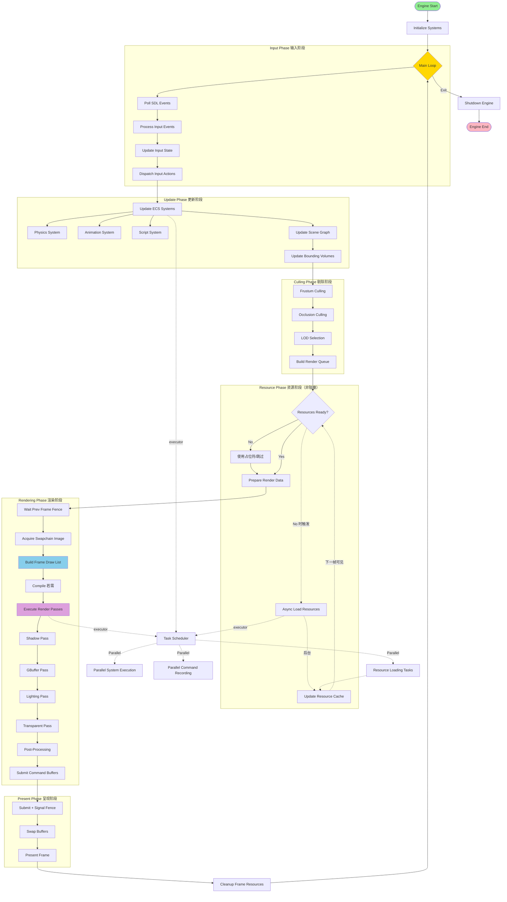
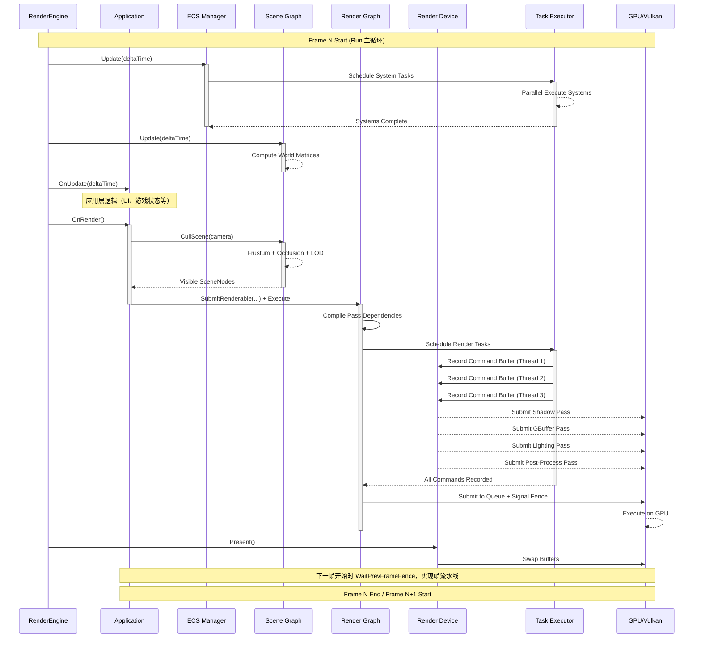

# Vulkan+SDL3 渲染引擎架构设计方案

## 目录
1. [系统架构图](#系统架构图)
2. [数据流框架图](#数据流框架图)
3. [模块详细设计](#模块详细设计)
4. [关键接口设计](#关键接口设计)（含错误处理策略）
5. [实现路线图](#实现路线图)

---

## 系统架构图

```mermaid
graph TB
    subgraph "应用层 Application Layer"
        A[Game/Application Code]
        B[Scene Manager]
        C[ECS Manager]
        D[Renderable Interface]
    end
    
    subgraph "渲染管线层 Rendering Pipeline Layer"
        E[Render Graph]
        F[Material System]
        G[Shader Manager]
        H[Render Passes]
        H1[Shadow Pass]
        H2[GBuffer Pass]
        H3[Lighting Pass]
        H4[Post-Process Pass]
        H --> H1
        H --> H2
        H --> H3
        H --> H4
    end
    
    subgraph "场景管理层 Scene Management Layer"
        I[ECS Core - 仅游戏逻辑]
        I1[Entity Manager]
        I2[Component Storage]
        I3[System Scheduler]
        I --> I1
        I --> I2
        I --> I3
        J[Scene Graph - Transform]
        K[Culling System - 内含于 SceneManager]
        L[LOD Manager - 剔除时选择 LOD]
    end
    
    subgraph "资源管理层 Resource Management Layer"
        M[Resource Loader]
        M1[Model Loader]
        M2[Texture Loader]
        M3[Shader Compiler]
        M --> M1
        M --> M2
        M --> M3
        N[Resource Cache]
        O[Staging Memory Manager]
        O1[Staging Buffer Pool]
        O2[Upload Queue]
        O --> O1
        O --> O2
    end
    
    subgraph "设备抽象层 Device Abstraction Layer"
        P[Rendering Device Interface - RDI]
        Q[Vulkan Backend]
        Q1[Instance/Device]
        Q2[Command Buffers]
        Q3[Pipeline State]
        Q4[Descriptor Sets]
        Q5[GPU Memory - VMA]
        Q6[Synchronization]
        Q --> Q1
        Q --> Q2
        Q --> Q3
        Q --> Q4
        Q --> Q5
        Q --> Q6
        R[OpenGL Backend]
        R1[GL Context]
        R2[State Cache]
        R --> R1
        R --> R2
        
        S[Input Device Module]
        S1[Keyboard Manager]
        S2[Mouse Manager]
        S3[Gamepad Manager]
        S4[Action Mapping]
        S --> S1
        S --> S2
        S --> S3
        S --> S4
        
        T[Window System]
        T1[SDL3 Window]
        T2[Swapchain Manager]
        T --> T1
        T --> T2
    end
    
    subgraph "底层执行器层 Executor Layer"
        U[Task Scheduler - executor]
        U1[Thread Pool]
        U2[Task Graph]
        U3[Async Resource Loading]
        U4[Parallel System Execution]
        U --> U1
        U --> U2
        U --> U3
        U --> U4
    end
    
    subgraph "平台层 Platform Layer"
        V[SDL3]
        W[Vulkan API]
        X[OpenGL API]
    end
    
    %% 连接关系
    A --> B
    A --> C
    A --> D
    B --> J
    C --> I
    D --> E
    
    E --> F
    E --> G
    E --> H
    F --> M
    G --> M
    
    I --> J
    I --> K
    I --> L
    J --> E
    K --> E
    
    E --> P
    M --> O
    M --> U
    
    P --> Q
    P --> R
    S --> V
    T --> V
    T --> P
    
    Q --> W
    R --> X
    
    I3 --> U
    E --> U
    
    style A fill:#e1f5ff
    style E fill:#fff4e1
    style I fill:#f0e1ff
    style M fill:#e1ffe1
    style P fill:#ffe1e1
    style U fill:#ffffe1
```



**架构说明**：
- **B (Scene Manager) / C (ECS Manager)**：应用层 Facade，B 代理 Scene Graph 操作（委托 J），C 代理 EntityManager 操作（委托 I）。
- **内存职责**：资源层 O (Staging Memory Manager) 负责 CPU→GPU 上传缓冲池；设备层 Q5 (GPU Memory - VMA) 负责 GPU 显存分配，由 RDI 封装。

---

## 数据流框架图



**与 Run() 的对应关系**：Input Phase → `inputManager->Update()`；Update Phase → `entityManager->Update()` + `sceneManager->Update()`；Culling/Resource/Rendering 均在 `OnRender()` 内完成（CullScene → SubmitRenderable → Execute，资源检查在 Draw 时隐式进行）。

---

## 详细组件数据流图



---

## 模块详细设计

### 1. 底层执行器层 (Executor Layer)

```cpp
// 基于 executor 库的 Facade，内部将任务映射为 executor.submit / TaskGraph
// SubmitRenderTask -> executor.submit(); SubmitSystemUpdate -> 构建 System 依赖图后 submit
// LoadResourceAsync -> executor.submit 返回 Future<Resource*>
// ParallelRecordCommands -> 按 Pass DAG 拓扑序分组，无依赖的 Pass 并行 submit 录制任务
class RenderTaskScheduler {
public:
    // 提交渲染任务
    template<typename Func>
    TaskHandle SubmitRenderTask(Func&& task, const std::vector<TaskHandle>& dependencies = {});
    
    // 提交系统更新任务
    TaskHandle SubmitSystemUpdate(System* system, const std::vector<TaskHandle>& deps);
    
    // 异步资源加载
    template<typename Resource>
    Future<Resource*> LoadResourceAsync(const std::string& path);
    
    // 等待所有任务完成
    void WaitAll();
    
    // 并行命令录制：仅对无依赖的 Pass 并行录制，每线程独立 CommandPool
    // Vulkan 要求每 VkCommandBuffer 单线程录制，需按 DAG 拓扑序分组
    void ParallelRecordCommands(const std::vector<RenderPass*>& passes);
};
```

### 2. 设备抽象层 (Device Abstraction Layer)

#### 2.1 渲染设备接口 (RDI)

```cpp
// 统一的渲染设备接口
class IRenderDevice {
public:
    virtual ~IRenderDevice() = default;
    
    // 设备管理
    virtual bool Initialize(const DeviceConfig& config) = 0;
    virtual void Shutdown() = 0;
    
    // 资源创建
    virtual BufferHandle CreateBuffer(const BufferDesc& desc, const void* data = nullptr) = 0;
    virtual TextureHandle CreateTexture(const TextureDesc& desc, const void* data = nullptr) = 0;
    virtual ShaderHandle CreateShader(const ShaderDesc& desc) = 0;
    virtual PipelineHandle CreatePipeline(const PipelineDesc& desc) = 0;
    
    // 命令录制：BeginCommandList(threadIndex) 用于多线程录制，每线程独立 CommandPool
    virtual CommandList* BeginCommandList(uint32_t threadIndex = 0) = 0;
    virtual void EndCommandList(CommandList* cmd) = 0;
    // Submit 时通过 fence 参数关联，GPU 完成时 signal，实现帧流水线
    virtual void Submit(const std::vector<CommandList*>& cmdLists, FenceHandle fence = {}) = 0;
    
    // 同步（避免每帧 WaitIdle）
    virtual void WaitIdle() = 0;
    virtual FenceHandle CreateFence() = 0;
    virtual void WaitForFence(FenceHandle fence) = 0;
    
    // 交换链：Acquire 在 Execute 开始时调用，Present 在 Run 中 Execute 之后调用
    virtual uint32_t AcquireNextImage() = 0;  // 返回当前 back buffer index，内部 signal semaphore
    virtual void Present() = 0;
    virtual TextureHandle GetBackBuffer() = 0;
};

// Vulkan 实现
class VulkanRenderDevice : public IRenderDevice {
    VkInstance instance;
    VkDevice device;
    VkPhysicalDevice physicalDevice;
    VmaAllocator allocator;
    
    // ... Vulkan 特定实现
};

// OpenGL 实现：需适配 RDI 的 CommandList 语义
// - 方案：维护命令队列，BeginCommandList 时分配可录制对象，EndCommandList 时缓存命令；
//   Submit 时按序执行。OpenGL 无多线程录制，ParallelRecordCommands 退化为单线程串行。
class OpenGLRenderDevice : public IRenderDevice {
    SDL_GLContext context;
    // ... OpenGL 特定实现
};
```

#### 2.2 输入设备模块

```cpp
#include <variant>

// 输入管理器
class InputManager {
public:
    void Initialize(SDL_Window* window);
    void Update();
    
    // 键盘
    bool IsKeyPressed(KeyCode key) const;
    bool IsKeyJustPressed(KeyCode key) const;
    bool IsKeyJustReleased(KeyCode key) const;
    
    // 鼠标
    glm::vec2 GetMousePosition() const;
    glm::vec2 GetMouseDelta() const;
    bool IsMouseButtonPressed(MouseButton button) const;
    float GetMouseWheelDelta() const;
    
    // 手柄
    bool IsGamepadConnected(int index) const;
    float GetGamepadAxis(int index, GamepadAxis axis) const;
    bool IsGamepadButtonPressed(int index, GamepadButton button) const;
    
    // 动作映射：AddActionBinding 添加绑定（同一 action 可多绑定，如 W 与 上箭头）
    void AddActionBinding(const std::string& action, const InputBinding& binding);
    void ClearActionBindings(const std::string& action);  // 清空某 action 的所有绑定
    bool IsActionTriggered(const std::string& action) const;
    float GetActionValue(const std::string& action) const;
    
    // 事件回调
    void RegisterCallback(InputEventType type, std::function<void(const InputEvent&)> callback);
};

// 输入绑定配置（使用 std::variant 保证类型安全）
struct GamepadBinding {
    int gamepadIndex;
    std::variant<GamepadButton, GamepadAxis> input;  // 按钮或轴
};

using InputBinding = std::variant<KeyCode, MouseButton, GamepadBinding>;

// 便捷构造
inline InputBinding Keyboard(KeyCode key) { return key; }
inline InputBinding Mouse(MouseButton btn) { return btn; }
inline InputBinding GamepadButton(int idx, GamepadButton button) {
    return GamepadBinding{idx, std::variant<GamepadButton, GamepadAxis>(button)};
}
inline InputBinding GamepadAxis(int idx, GamepadAxis axisValue) {
    return GamepadBinding{idx, std::variant<GamepadButton, GamepadAxis>(axisValue)};
}
```

### 3. 资源管理层

```cpp
// 资源管理器（构造时注入 RenderTaskScheduler*；LoadAsync 内部调用 scheduler->LoadResourceAsync 并登记为 ResourceHandle）
class ResourceManager {
public:
    explicit ResourceManager(RenderTaskScheduler* scheduler);
    // 异步加载
    template<typename T>
    Future<ResourceHandle<T>> LoadAsync(const std::string& path);
    
    // 同步加载（失败返回空句柄，可通过 GetLastError 获取原因）
    template<typename T>
    ResourceHandle<T> Load(const std::string& path);
    
    // 获取资源
    template<typename T>
    T* Get(ResourceHandle<T> handle);
    
    // 释放资源
    void Unload(ResourceHandle<> handle);
    
    // 资源热重载
    void EnableHotReload(bool enable);
    
    std::string GetLastError() const;  // 加载失败时获取原因
    
private:
    ResourceCache cache;
    std::vector<std::unique_ptr<IResourceLoader>> loaders;
    RenderTaskScheduler* scheduler;
};

// 模型加载器
class ModelLoader : public IResourceLoader {
public:
    Mesh* Load(const std::string& path) override;
    // 支持 glTF, OBJ, FBX 等格式
};

// 纹理加载器
class TextureLoader : public IResourceLoader {
public:
    Texture* Load(const std::string& path) override;
    // 支持压缩格式: BC, ASTC, ETC2 等
};

// 材质加载器：从 JSON 解析材质定义，引用 Texture 等资源
class MaterialLoader : public IResourceLoader {
public:
    Material* Load(const std::string& path) override;
};
```

**资源异步策略**：主循环不阻塞。LoadAsync 内部调用 `RenderTaskScheduler::LoadResourceAsync`，将结果登记入 ResourceCache 后返回 `Future<ResourceHandle<T>>`。资源检查在 `SubmitRenderable` 或 `Draw` 时隐式进行；未就绪时使用占位符或跳过，并触发 `LoadAsync`（若尚未触发）；异步加载完成后下一帧自动使用真实资源。

### 4. 场景管理层

#### 4.1 架构职责划分

本设计采用**以场景图为主**的架构：

- **Scene Graph**：负责 Transform 层级、世界矩阵计算、场景剔除、Renderable 管理。所有需要渲染的对象挂载在场景图节点上。
- **ECS**：仅负责游戏逻辑（物理、动画、脚本等），不管理 Transform。逻辑组件通过 Entity 引用 Scene Graph 节点，或通过共享数据与场景交互。
- **Renderable**：负责渲染，由应用层在 `OnRender()` 中从 Scene Graph 获取可见对象，显式提交到 Render Graph。

**统一更新顺序**（详见 4.2）：ECS::Update → 逻辑系统写回 Scene Graph → SceneManager::Update → OnUpdate → OnRender（CullScene + SubmitRenderable + Execute）。

#### 4.2 ECS 与 Scene Graph 的双向同步

逻辑系统（物理、动画等）更新后，需将结果写回 Scene Graph，以便渲染使用正确的 Transform：

- **写回接口**：`SceneNode::SetLocalTransform(transform)` 或 `SceneManager::SetNodeTransform(node, transform)`。逻辑系统在更新后调用，更新节点的 local 变换。
- **更新顺序**：每帧 `ECS::Update()` → 逻辑系统计算并写回 Scene Graph → `SceneManager::Update()` 计算世界矩阵。ECS 系统通过 `SceneNodeRef` 获取节点并写回。
- **SceneNodeRef 组件**：使用句柄而非裸指针，提供 ECS 到 Scene Graph 的安全桥接（详见 4.2.2 生命周期与引用安全）。

##### 4.2.1 写回竞争与依赖声明

**核心约束**：同一 SceneNode 同一帧内仅应有一个 System 作为「主写者」；若多 System 需写同一节点，必须通过显式依赖声明建立顺序，且后写者覆盖先写者（典型用法：PhysicsSystem 写位置 → AnimationSystem 写骨骼驱动的根节点位移，二者通常作用于不同 Entity，避免冲突）。

**依赖声明机制**：

- 每个 System 实现 `GetDependencies()`，返回其所依赖的 System 类型列表。EntityManager 在构建任务图时据此建立 DAG，保证依赖的 System 先执行。
- 多 System 写同一 SceneNode 时，必须在依赖链上形成先后关系；否则视为配置错误。

```cpp
// 系统基类：增加依赖声明
class System {
public:
    virtual void Update(float deltaTime, EntityManager& em) = 0;
    virtual void OnEntityCreated(Entity entity) {}
    virtual void OnEntityDestroyed(Entity entity) {}
    
    // 返回本 System 所依赖的 System 类型；调度器据此构建 DAG，保证依赖者先执行
    // 例如 AnimationSystem 依赖 PhysicsSystem，则 Physics 先于 Animation 执行
    virtual std::vector<std::type_index> GetDependencies() const { return {}; }
};
```

**开发期冲突检测**（可选，`#ifdef ENABLE_SCENE_WRITE_VALIDATION`）：

- EntityManager 在每帧 Update 结束时，检查是否存在同一 SceneNode 被多个无依赖关系的 System 写入。
- 实现方式：每个 System 在 Update 中写入 SceneNode 时，通过 `EntityManager::NotifySceneNodeWritten(SceneNodeHandle, SystemTypeId)` 登记；帧末汇总，若发现同一节点被多个 System 写入且这些 System 之间无依赖链，则断言或日志警告。
- 发布版本可关闭此检测以保持性能。

**推荐实践**：

- 每个 SceneNode 的「主写者」尽量单一：物理驱动用 PhysicsSystem，动画驱动用 AnimationSystem，避免同一 Entity 同时挂载会写同一节点的多个 System。
- 若必须多阶段写（如 Physics + IK），通过 `GetDependencies()` 明确顺序，并约定写回语义（覆盖或累加）。

##### 4.2.2 生命周期与引用安全

**问题**：SceneNodeRef 若持有裸指针 `SceneNode*`，场景切换或节点销毁时会产生悬空引用，难以检测且易引发未定义行为。

**解决方案：句柄 + 校验**

- **SceneNodeHandle**：不透明句柄（`uint64_t`），由 SceneManager 在创建节点时分配，节点销毁时失效。
- **SceneNodeRef**：存储 `SceneNodeHandle`，通过 `SceneManager::GetNode(handle)` 解析为 `SceneNode*`；节点已销毁时返回 `nullptr`。
- **绑定与解析**：`SceneNodeRef::FromNode(SceneNode*)` 建立引用；使用前通过 `GetNode(SceneManager*)` 获取指针，返回 `nullptr` 表示已失效。

```cpp
// 场景节点句柄（不透明，由 SceneManager 分配）
using SceneNodeHandle = uint64_t;
constexpr SceneNodeHandle kInvalidSceneNodeHandle = 0;

// 安全的场景节点引用组件
struct SceneNodeRef {
    SceneNodeHandle handle = kInvalidSceneNodeHandle;
    
    bool IsValid() const { return handle != kInvalidSceneNodeHandle; }
    
    // 解析为 SceneNode*；节点已销毁时返回 nullptr（调用方需校验）
    SceneNode* GetNode(SceneManager* sceneMgr) const {
        return sceneMgr ? sceneMgr->GetNode(handle) : nullptr;
    }
    
    // 从已有节点创建引用（获取其 handle 并存储）
    static SceneNodeRef FromNode(SceneNode* node) {
        SceneNodeRef ref;
        ref.handle = node ? node->GetHandle() : kInvalidSceneNodeHandle;
        return ref;
    }
};
```

**SceneManager 扩展**：

- 维护 `SceneNodeHandle → SceneNode*` 的注册表；`CreateScene` / `AddChild` 时分配 handle 并注册；节点销毁时从注册表移除。
- `SetActiveScene(newRoot)` 时，先销毁旧场景（递归销毁节点并从注册表移除），再激活新场景。此时所有指向旧节点的 SceneNodeHandle 失效，`GetNode` 返回 `nullptr`。

**场景切换流程**：

1. 应用层在切换前，对引用旧场景节点的 Entity 调用 `RemoveComponent<SceneNodeRef>()` 或重新绑定到新场景节点。
2. 调用 `SceneManager::SetActiveScene(newRoot)`。
3. （可选）`SetActiveScene` 在 Debug 模式下可遍历当前 Entity 的 SceneNodeRef，检查是否有 handle 指向即将销毁的节点，若有则断言或日志，强制调用方先解绑。

**System 使用示例**（必须校验有效性）：

```cpp
// 示例：物理系统写回 Scene Graph（使用句柄，校验有效性）
class PhysicsSystem : public System {
public:
    std::vector<std::type_index> GetDependencies() const override { return {}; }
    
    void Update(float deltaTime, EntityManager& em) override {
        auto* sceneMgr = em.GetSceneManager();  // EntityManager 需持有 SceneManager 指针
        for (auto& entity : em.EntitiesWith<PhysicsComponent, SceneNodeRef>()) {
            auto& physics = entity.GetComponent<PhysicsComponent>();
            auto& nodeRef = entity.GetComponent<SceneNodeRef>();
            auto* node = nodeRef.GetNode(sceneMgr);
            if (!node) continue;  // 节点已销毁，跳过
            physics.velocity += gravity * deltaTime;
            physics.position += physics.velocity * deltaTime;
            node->SetLocalTransform(Transform(physics.position, physics.rotation));
        }
    }
};
```

#### 4.3 ECS 核心

```cpp
// 实体（轻量句柄，支持组件操作）
class Entity {
public:
    template<typename T, typename... Args>
    T& AddComponent(Args&&... args);
    template<typename T>
    T* GetComponent();
    template<typename T>
    bool HasComponent() const;
    void RemoveComponent(ComponentTypeId type);
};

// 实体管理器（构造时注入 RenderTaskScheduler* 和 SceneManager*，用于 System 并行调度及 SceneNodeRef 解析）
class EntityManager {
public:
    explicit EntityManager(RenderTaskScheduler* scheduler, SceneManager* sceneMgr = nullptr);
    void SetSceneManager(SceneManager* sceneMgr);  // 可后续注入
    SceneManager* GetSceneManager() const;
    Entity CreateEntity();
    void DestroyEntity(Entity entity);
    bool IsAlive(Entity entity) const;
    // 内部：根据 System::GetDependencies() 构建任务 DAG → 提交给 RenderTaskScheduler → 并行执行
    void Update(float deltaTime);
};

// 组件存储 (AoS 布局)
template<typename T>
class ComponentStorage {
public:
    void Add(Entity entity, const T& component);
    void Remove(Entity entity);
    T& Get(Entity entity);
    bool Has(Entity entity) const;
    
    // 迭代器
    auto begin() { return components.begin(); }
    auto end() { return components.end(); }
    
private:
    std::vector<T> components;
    std::unordered_map<Entity, size_t> entityToIndex;
};

// 系统基类
class System {
public:
    virtual void Update(float deltaTime, EntityManager& em) = 0;
    virtual void OnEntityCreated(Entity entity) {}
    virtual void OnEntityDestroyed(Entity entity) {}
    virtual std::vector<std::type_index> GetDependencies() const { return {}; }
};

```

#### 4.4 Scene Manager 与 Scene Graph

- **SceneManager**：场景生命周期管理，维护当前活动场景，是 Scene Graph 的 facade。
- **Scene Graph**：内部结构，存储节点树。`SceneManager::CreateScene()` 返回根 `SceneNode*`。
- **SceneNode**：持有一个 Renderable（可选）、localTransform，提供父子层级。子节点继承父节点的世界变换。
- **Renderable 所有权**：由应用层或工厂创建；Mesh/Material 由 ResourceManager 加载并缓存，Renderable 持有非占有指针；SceneNode 持有 Renderable 的非占有指针。多 SceneNode 可共享同一 Renderable（实例化）。
- **工厂函数**（引擎或应用层提供）：`std::unique_ptr<SceneNode> CreateStaticMeshNode(Mesh* mesh, Material* material)` 创建挂载 StaticMesh 的节点；`std::unique_ptr<CameraNode> CreateCameraNode()` 创建相机节点。

```cpp
// Pass 标志（Renderable 参与哪些 Pass，位掩码）
enum PassFlags : uint32_t {
    ShadowCaster = 1,   // 参与 Shadow Pass
    Opaque      = 2,    // 参与 GBuffer Pass（不透明几何体）
    Transparent = 4,    // 参与 Transparent Pass
    All         = ShadowCaster | Opaque | Transparent
};

class SceneNode {
public:
    void SetLocalTransform(const Transform& t);
    const Transform& GetLocalTransform() const;
    const glm::mat4& GetWorldMatrix() const;  // 由 SceneManager::Update 计算
    
    SceneNode* AddChild(std::unique_ptr<SceneNode> child);
    void SetRenderable(Renderable* r);
    Renderable* GetRenderable() const;
    void SetPassFlags(PassFlags f) { passFlags = f; }
    PassFlags GetPassFlags() const { return passFlags; }
    
    SceneNodeHandle GetHandle() const { return handle_; }  // 创建时由 SceneManager 分配
    
    SceneNode* parent;
    PassFlags passFlags = PassFlags::All;
    std::vector<std::unique_ptr<SceneNode>> children;
private:
    SceneNodeHandle handle_ = kInvalidSceneNodeHandle;  // 由 SceneManager 在 CreateScene/AddChild 时设置
};

class SceneManager {
public:
    SceneNode* CreateScene();  // 内部分配 SceneNodeHandle 并注册
    void Update(float deltaTime);  // 递归计算世界矩阵（含 UpdateBounds）
    // 场景切换：销毁旧场景（从 handle 注册表移除），激活新场景
    // Debug 模式下可校验是否有 Entity 的 SceneNodeRef 仍引用即将销毁的节点
    void SetActiveScene(SceneNode* root);
    // 句柄与节点互查（用于 SceneNodeRef 安全解析）
    SceneNodeHandle GetHandle(SceneNode* node) const;
    SceneNode* GetNode(SceneNodeHandle handle) const;  // 已销毁返回 nullptr；通过 handleRegistry 查找
    // CullScene 内部调用 Culling System（视锥/遮挡剔除）和 LOD Manager（选 LOD）
    // LOD 传递：LOD Manager 选择后写入 Renderable 的 currentLOD 或 SceneNode 的 LOD 索引，Draw 时 Renderable 使用选定 LOD 的 mesh
    std::vector<SceneNode*> CullScene(CameraNode* camera);
    // 多相机：返回 visibleByCamera[i] 对应 cameras[i] 的可见列表
    std::vector<std::vector<SceneNode*>> CullScene(const std::vector<CameraNode*>& cameras);
private:
    std::unordered_map<SceneNodeHandle, SceneNode*> handleRegistry;  // 节点创建时注册，销毁时移除
};
```

#### 4.5 Camera 归属

Camera 作为 Scene Graph 的节点类型，参与层级变换（如挂在角色头上）：

```cpp
class CameraNode : public SceneNode {
public:
    Camera camera;  // FOV, near/far, view/projection 矩阵
    // GetWorldMatrix() 提供相机位置和朝向
};
```

多相机/多视口：`CullScene` 可接受多个 camera，返回按 camera 分组的可见列表；Render Graph 支持多套 Pass 链输出到不同 RenderTarget（小地图、分屏等）。

**多相机 Render Graph 用法**：方案 A）为每相机维护独立 RenderGraph 实例，Execute 时指定 RenderTarget；方案 B）单 RenderGraph 支持 Execute(cameraIndex, target)，内部按 camera 切换绑定的 RenderTarget 后执行；方案 C）应用层对每相机分别 ClearSubmitted、SubmitRenderable、Execute 到不同 RenderTarget。具体实现待 Phase 6 确定。

```cpp
// 多相机示例：小地图 + 主相机
auto cameras = std::vector<CameraNode*>{ mainCamera, minimapCamera };
auto visibleByCamera = sceneManager->CullScene(cameras);  // 返回 vector<vector<SceneNode*>>
// visibleByCamera[0] 对应 mainCamera；visibleByCamera[1] 对应 minimapCamera
// 应用层分别 SubmitRenderable 到各自的 RenderTarget 或 Pass 链
```

#### 4.6 Renderable 抽象层

**Transform 来源**：Renderable 不存储 Transform，由 SceneNode 在绘制时传入。`Draw(cmd, worldTransform)` 接收当前帧的世界矩阵。

**LOD 支持**：支持 LOD 的 Renderable（如 StaticMesh）实现 `GetMeshForLOD(lod)` 或持有 `currentLOD`；CullScene 内 LOD Manager 写入后，Draw 时使用对应 mesh。

```cpp
// 简化的渲染对象接口
class Renderable {
public:
    virtual void Draw(CommandList& cmd, const glm::mat4& worldTransform) {
        cmd.BindPipeline(material->GetPipeline());
        cmd.BindDescriptorSet(0, material->GetMaterialDescriptorSet());
        cmd.SetPushConstants(&worldTransform, sizeof(glm::mat4));
        cmd.DrawMesh(GetMesh());  // GetMesh() 考虑 LOD，无 LOD 时返回 mesh
    }
    virtual Mesh* GetMesh() const { return mesh; }  // 子类可重写以支持 LOD
    
    Mesh* mesh;
    Material* material;
    BoundingBox bounds;  // 用于剔除，可从 mesh 计算
};

// 静态网格：支持 LOD 时持有 meshLODs 和 currentLOD，重写 GetMesh()
class StaticMesh : public Renderable { /* 无 LOD 时 GetMesh() 返回 mesh；有 LOD 时返回 meshLODs[currentLOD] */ };

// 骨骼网格：骨骼数据由 AnimationSystem 更新并写回 Skeleton
class SkeletalMesh : public Renderable {
public:
    void Draw(CommandList& cmd, const glm::mat4& worldTransform) override {
        // 绑定骨骼矩阵 UBO，其余同 StaticMesh
    }
    Skeleton* skeleton;
    AnimationController* animController;
};
```

#### 4.7 动画系统与 Scene Graph

- **骨骼动画**：AnimationSystem 在 ECS 中运行，更新 `Skeleton::boneMatrices`。Skeleton 与 AnimationController 由 Entity 的 SkeletalMeshComponent 持有，与该 Entity 的 SceneNodeRef 关联的 SkeletalMesh 共享同一 Skeleton 实例。
- **动画驱动 Transform**：若动画直接驱动根节点位移，AnimationSystem 写回 `SceneNode::SetLocalTransform()`。
- **更新顺序**：ECS（AnimationSystem）→ 写回 Scene Graph → SceneManager::Update（计算世界矩阵）。

### 5. 渲染管线层

#### 5.1 渲染图系统

```cpp
// 每帧提交的绘制项（Renderable + 世界矩阵）
struct SubmittedDraw {
    Renderable* renderable;
    glm::mat4 worldTransform;
    PassFlags passFlags;  // ShadowCaster|Opaque|Transparent，控制各 Pass 是否绘制
};

// Pass 执行时的上下文，提供对已提交数据的访问
struct RenderPassContext {
    const std::vector<SubmittedDraw>& GetSubmittedDraws() const;
    // 按 Pass 过滤：过滤条件 (draw.passFlags & pass) != 0；Shadow 用 ShadowCaster，GBuffer 用 Opaque
    std::vector<SubmittedDraw> GetDrawsForPass(PassFlags pass) const;
};

class RenderGraph {
public:
    // 添加渲染Pass
    RenderPassHandle AddPass(const std::string& name, 
                             const RenderPassSetup& setup,
                             const RenderPassExecute& execute);
    
    // 声明资源依赖
    ResourceHandle DeclareTexture(const std::string& name, const TextureDesc& desc);
    ResourceHandle DeclareBuffer(const std::string& name, const BufferDesc& desc);
    
    // 应用层显式提交可见 Renderable（含世界矩阵与 passFlags）
    void SubmitRenderable(Renderable* renderable, const glm::mat4& worldTransform, PassFlags passFlags = PassFlags::All);
    void ClearSubmitted();
    
    // 编译和执行：Compile 在管线/分辨率变化时调用，Execute 每帧调用
    void Compile();   // 分析依赖、分配资源、构建 Pass DAG
    // Execute 流程：WaitPrevFrameFence → AcquireSwapchainImage → BuildFrameDrawList → Record → Submit(含 Semaphore)；Present 由 Run 在 Execute 之后调用
    void Execute(IRenderDevice* device);
    
    // BuildFrameDrawList：应用层 SubmitRenderable 后，RG 内部整理本帧 SubmittedDraws
    // 帧末回收：Execute 结束时遍历本帧使用的 Material，调用 ReleaseAllInstanceDescriptorSets()
    
private:
    std::vector<RenderPass> passes;
    std::vector<Resource> resources;
    DependencyGraph dependencyGraph;
};

// 使用示例
// Setup：在 Application::OnInitialize 或 Engine 初始化时调用
// Compile：在分辨率/管线变化时调用
// Execute：每帧在 OnRender 中调用
void SetupRenderGraph(RenderGraph& rg) {
    // Shadow Pass
    auto shadowMap = rg.DeclareTexture("ShadowMap", {2048, 2048, Format::D32});
    rg.AddPass("ShadowPass", 
        [&](RenderPassBuilder& builder) {
            builder.WriteDepth(shadowMap);
        },
        [](const RenderPassContext& ctx, CommandList& cmd) {
            for (const auto& draw : ctx.GetDrawsForPass(PassFlags::ShadowCaster)) {
                draw.renderable->Draw(cmd, draw.worldTransform);
            }
        });
    
    // GBuffer Pass
    auto gbufferAlbedo = rg.DeclareTexture("GBuffer.Albedo", {1920, 1080, Format::RGBA8});
    auto gbufferNormal = rg.DeclareTexture("GBuffer.Normal", {1920, 1080, Format::RGBA16F});
    auto gbufferDepth = rg.DeclareTexture("GBuffer.Depth", {1920, 1080, Format::D24S8});
    
    rg.AddPass("GBufferPass",
        [&](RenderPassBuilder& builder) {
            builder.WriteColor(0, gbufferAlbedo);
            builder.WriteColor(1, gbufferNormal);
            builder.WriteDepth(gbufferDepth);
            builder.ReadTexture(shadowMap);
        },
        [](const RenderPassContext& ctx, CommandList& cmd) {
            for (const auto& draw : ctx.GetDrawsForPass(PassFlags::Opaque)) {
                draw.renderable->Draw(cmd, draw.worldTransform);
            }
        });
    
    // Lighting Pass
    auto lightingResult = rg.DeclareTexture("Lighting", {1920, 1080, Format::RGBA16F});
    rg.AddPass("LightingPass",
        [&](RenderPassBuilder& builder) {
            builder.ReadTexture(gbufferAlbedo);
            builder.ReadTexture(gbufferNormal);
            builder.ReadTexture(gbufferDepth);
            builder.ReadTexture(shadowMap);
            builder.WriteColor(0, lightingResult);
        },
        [](const RenderPassContext& ctx, CommandList& cmd) {
            // PBR 光照计算
        });
    
    // Post-Processing
    auto finalColor = rg.DeclareTexture("FinalColor", {1920, 1080, Format::RGBA8});
    rg.AddPass("PostProcess",
        [&](RenderPassBuilder& builder) {
            builder.ReadTexture(lightingResult);
            builder.WriteColor(0, finalColor);
        },
        [](const RenderPassContext& ctx, CommandList& cmd) {
            // Bloom, Tone Mapping, FXAA
        });
    
    // 输出到 Swapchain：将 finalColor resolve 到 back buffer
    rg.AddPass("OutputToSwapchain",
        [&](RenderPassBuilder& builder) {
            builder.ReadTexture(finalColor);
            builder.WriteSwapchain();  // 声明写入当前 back buffer
        },
        [](const RenderPassContext& ctx, CommandList& cmd) {
            // Blit/Copy finalColor → GetBackBuffer()
        });
}
```

#### 5.2 材质系统

材质系统区分**材质级（共享）**和**实例级（per-draw）**的 DescriptorSet：

- **材质级 DescriptorSet**：同一材质的所有实例共享，包含纹理、采样器等不变资源。
- **实例级 DescriptorSet**：每个绘制调用可有独立参数（如 per-instance 的 push constants 或 Dynamic UBO）。

```cpp
class Material {
public:
    void SetTexture(const std::string& name, Texture* texture);
    void SetParameter(const std::string& name, const void* data, size_t size);
    
    Shader* GetShader() const { return shader; }
    PipelineHandle GetPipeline() const { return pipeline; }
    
    // 材质级：同一材质实例共享
    DescriptorSetHandle GetMaterialDescriptorSet() const { return materialDescriptorSet; }
    
    // 实例级：每绘制调用可单独绑定（用于 per-instance 数据）
    // 生命周期：由 Material 管理池化，Acquire 在 Draw 时调用；Release 由 RenderGraph::Execute 结束时
    // 统一回收：Execute 遍历本帧 SubmittedDraws 中的 Material 并调用 ReleaseAllInstanceDescriptorSets()
    DescriptorSetHandle AcquireInstanceDescriptorSet(const void* instanceData, size_t size);
    
private:
    Shader* shader;
    PipelineHandle pipeline;
    DescriptorSetHandle materialDescriptorSet;  // 共享
    std::unordered_map<std::string, MaterialParameter> parameters;
};

// PBR 材质
class PBRMaterial : public Material {
public:
    void SetAlbedo(Texture* tex);
    void SetNormal(Texture* tex);
    void SetMetallic(float value);
    void SetRoughness(float value);
    void SetAO(Texture* tex);
    void SetEmissive(Texture* tex);
};
```

---

## 关键接口设计

### 引擎初始化接口

```cpp
class RenderEngine {
public:
    struct Config {
        // 窗口配置
        uint32_t width = 1920;
        uint32_t height = 1080;
        bool fullscreen = false;
        bool vsync = true;
        
        // 渲染后端
        enum Backend { Vulkan, OpenGL } backend = Vulkan;
        
        // 线程配置
        uint32_t workerThreads = std::thread::hardware_concurrency() - 1;
        
        // 资源路径
        std::string assetPath = "./assets";
        std::string shaderPath = "./shaders";
    };
    
    // 初始化失败返回 false，可通过 GetLastError() 获取详细错误信息
    // 初始化顺序：scheduler → sceneManager → entityManager(scheduler, sceneManager) / resourceManager(scheduler) / renderGraph
    // EntityManager 需持有 SceneManager 指针，供 System 中 SceneNodeRef::GetNode 解析句柄
    bool Initialize(const Config& config);
    std::string GetLastError() const;  // 线程安全，返回最近一次失败原因
    void Shutdown();
    
    void Run(Application* app);  // 主循环，传入 Application
    void Stop();
    
    // 获取子系统
    IRenderDevice* GetRenderDevice();
    InputManager* GetInputManager();
    ResourceManager* GetResourceManager();
    EntityManager* GetEntityManager();
    SceneManager* GetSceneManager();
    RenderGraph* GetRenderGraph();
    
private:
    std::unique_ptr<IRenderDevice> renderDevice;
    std::unique_ptr<InputManager> inputManager;
    std::unique_ptr<ResourceManager> resourceManager;
    std::unique_ptr<EntityManager> entityManager;
    std::unique_ptr<SceneManager> sceneManager;
    std::unique_ptr<RenderTaskScheduler> scheduler;
    std::unique_ptr<RenderGraph> renderGraph;
};

// Run() 主循环伪代码
// 需先调用 Run(app)；Application 由外部传入；Initialize 时已注入 scheduler 到 EntityManager/ResourceManager
void RenderEngine::Run(Application* app) {
    app->SetEngine(this);
    float deltaTime = 0.f;
    // auto tPrev = now(); 每帧 deltaTime = (now() - tPrev).count() / 1e9f; tPrev = now();
    while (!shouldStop) {
        inputManager->Update();
        entityManager->Update(deltaTime);      // ECS 逻辑，写回 Scene Graph
        sceneManager->Update(deltaTime);       // 计算世界矩阵（含 UpdateBounds）
        app->OnUpdate(deltaTime);              // 仅应用层逻辑，不再调用 ECS/Scene
        app->OnRender();                       // 剔除、提交、Execute（含 WaitFence + Submit）
        renderDevice->Present();
        // deltaTime = ... 更新 deltaTime
    }
}
```

### 应用程序接口

```cpp
class Application {
public:
    virtual bool OnInitialize() = 0;
    virtual void OnUpdate(float deltaTime) = 0;
    virtual void OnRender() = 0;
    virtual void OnShutdown() = 0;
    
    void SetEngine(RenderEngine* e) { engine = e; }  // Run 开始前由 Engine 调用
    
protected:
    RenderEngine* engine = nullptr;
};

// 使用示例（需成员：SceneNode* sceneRoot; CameraNode* camera;）
class MyGame : public Application {
public:
    bool OnInitialize() override {
        // 加载资源（Load 失败返回空句柄，Get 返回 nullptr；实际应检查）
        // Material 可由 MaterialLoader 从 JSON 解析，或应用层基于 Load<Texture> 等手动构建
        auto* resMgr = engine->GetResourceManager();
        auto meshHandle = resMgr->Load<Mesh>("models/character.gltf");
        auto matHandle = resMgr->Load<Material>("materials/character.json");
        auto* mesh = resMgr->Get(meshHandle);
        auto* material = resMgr->Get(matHandle);
        
        // 创建场景图节点与 Renderable（Transform 由 Scene Graph 管理）
        sceneRoot = engine->GetSceneManager()->CreateScene();
        auto meshNode = sceneRoot->AddChild(CreateStaticMeshNode(mesh, material));
        
        // 创建 ECS 实体（仅用于游戏逻辑）；PlayerControllerSystem 读取输入并写回 SceneNodeRef
        auto entity = engine->GetEntityManager()->CreateEntity();
        entity.AddComponent<PlayerController>();
        entity.AddComponent<SceneNodeRef>(SceneNodeRef::FromNode(meshNode));  // 使用句柄建立安全引用
        
        // 设置相机（CreateCameraNode 返回 unique_ptr<CameraNode>，AddChild 后保存指针供 CullScene 使用）
        auto cameraNode = CreateCameraNode();
        camera = static_cast<CameraNode*>(sceneRoot->AddChild(std::move(cameraNode)));
        
        // 输入绑定
        auto input = engine->GetInputManager();
        input->AddActionBinding("MoveForward", Keyboard(KeyCode::W));
        input->AddActionBinding("Jump", Keyboard(KeyCode::Space));
        
        return true;
    }
    
    void OnUpdate(float deltaTime) override {
        // 注意：ECS 与 Scene 的 Update 由 Engine::Run 统一调用；此处仅做应用层逻辑
        // 玩家移动/跳跃等由 PlayerControllerSystem 在 ECS::Update 中处理（通过 SceneNodeRef 写回 Scene Graph）
        // OnUpdate 用于 UI、游戏状态、关卡逻辑等不涉及 ECS 的高层逻辑
    }
    
    void OnRender() override {
        // 应用层显式提交：从场景图获取可见节点，提交 (Renderable, worldTransform) 到 Render Graph
        auto visibleNodes = engine->GetSceneManager()->CullScene(camera);
        auto* rg = engine->GetRenderGraph();
        rg->ClearSubmitted();
        for (auto* node : visibleNodes) {
            if (auto* r = node->GetRenderable())
                rg->SubmitRenderable(r, node->GetWorldMatrix(), node->GetPassFlags());
        }
        engine->GetRenderGraph()->Execute(engine->GetRenderDevice());
    }
};
```

### 错误处理策略

- **初始化失败**：`Initialize()` 返回 `false`，`GetLastError()` 返回详细原因；调用方负责不继续调用其他接口，必要时调用 `Shutdown()` 清理。
- **资源加载失败**：`Load()` 返回空句柄，`GetLastError()` 返回原因；异步加载通过 `Future` 的异常或错误状态传递。
- **统一约定**：错误信息通过 `GetLastError()` 获取，不抛出异常；关键路径失败时保证可恢复或安全退出。

---

## 实现路线图

### Phase 1: 基础框架 (2-3周)
- [ ] 集成 executor 库
- [ ] SDL3 窗口系统
- [ ] Vulkan 基础封装 (Instance, Device, Swapchain)
- [ ] 简单的三角形渲染
- [ ] 输入系统基础

### Phase 2: 设备抽象层 (2-3周)
- [ ] 完整的 RDI 接口设计
- [ ] Vulkan Backend 完整实现
- [ ] OpenGL Backend 基础实现
- [ ] 资源管理基础 (Buffer, Texture)
- [ ] 命令录制系统

### Phase 3: 资源管理 (2周)
- [ ] 资源加载器框架
- [ ] 模型加载 (glTF)
- [ ] 纹理加载和压缩格式支持
- [ ] 着色器编译系统
- [ ] 异步资源加载

### Phase 4: ECS 核心 + 场景图 (2-3周)
- [ ] Entity Manager
- [ ] Component Storage (AoS)
- [ ] System Scheduler
- [ ] Scene Graph（Transform 层级、世界矩阵）
- [ ] 基础视锥剔除（CullScene 依赖）
- [ ] 基础逻辑组件与系统

### Phase 5: 渲染管线 + Renderable 显式提交 (3-4周)
- [ ] Renderable 基类、StaticMesh / SkeletalMesh
- [ ] Scene Graph 与 Renderable 集成、应用层显式提交流程
- [ ] Render Graph 系统
- [ ] Forward Rendering Pipeline
- [ ] Deferred Rendering Pipeline
- [ ] Shadow Mapping
- [ ] PBR 材质系统

### Phase 6: 高级特性 (3-4周)
- [ ] 场景剔除增强（遮挡剔除）
- [ ] LOD 系统
- [ ] Post-Processing (Bloom, TAA, Tone Mapping)
- [ ] GPU Instancing
- [ ] 多线程命令录制

### Phase 7: 工具和优化 (2-3周)
- [ ] 性能分析器
- [ ] 着色器热重载
- [ ] 资源烘焙工具
- [ ] 调试可视化
- [ ] 内存优化

---

## 技术栈总结

### 核心依赖
- **Vulkan**: 现代图形API
- **SDL3**: 窗口和输入管理
- **executor**: 任务调度和多线程
- **VMA (Vulkan Memory Allocator)**: GPU内存管理

### 推荐的第三方库
- **glm**: 数学库
- **tinygltf**: glTF模型加载
- **stb_image**: 图像加载
- **assimp**: 多格式模型加载 (可选)
- **imgui**: 调试UI (可选)
- **Tracy**: 性能分析 (可选)
- **SPIRV-Cross**: 着色器反射和转换

### 构建系统
- **CMake**: 跨平台构建
- **vcpkg/Conan**: 依赖管理

---

## 性能目标

- **60 FPS** 在 1080p 分辨率
- **支持 10,000+ 绘制调用** (通过 GPU Instancing)
- **多线程命令录制** 充分利用多核 CPU
- **资源流式加载** 不阻塞主线程
- **低延迟输入响应** < 1 frame

---

## 扩展性设计

1. **插件系统**: 支持动态加载渲染Pass和后处理效果
2. **脚本支持**: 集成 Lua/Python 用于游戏逻辑
3. **网络同步**: 预留接口支持多人游戏
4. **VR支持**: 通过 OpenXR 集成
5. **移动平台**: 通过 Vulkan Mobile 和 SDL3 支持
6. **多视口/多相机**: Camera 作为 SceneNode，`CullScene` 可接受多 camera；Render Graph 支持多套 Pass 链输出到不同 RenderTarget（小地图、分屏等）

---

## 参考架构

本设计参考了以下引擎架构:
- **Unreal Engine**: ECS + Render Graph
- **Unity DOTS**: 数据导向设计
- **Frostbite**: Frame Graph 系统
- **The Forge**: 跨平台渲染抽象
- **bgfx**: 渲染后端抽象

---

## 总结

这个渲染引擎设计:
1. ✅ **模块化**: 清晰的分层架构,易于维护和扩展
2. ✅ **高性能**: 多线程、异步加载、现代渲染技术
3. ✅ **灵活性**: 场景图为主 + ECS 逻辑 + Renderable 显式提交的清晰分工
4. ✅ **可替换**: 渲染后端可在 Vulkan 和 OpenGL 之间切换
5. ✅ **生产就绪**: 包含完整的工具链和优化策略

整个架构围绕 **executor** 的任务调度能力,充分利用多线程优势,同时通过 Render Graph 实现资源管理自动化,为快速开发高质量渲染应用打下坚实基础。

> **线程间数据通信**：底层执行器层通过 TaskChannel、TaskData、TaskGraph 等机制实现无死锁、无数据竞争的线程间通信，详见 [executor_layer_design.md](../executor/executor_layer_design.md)。
