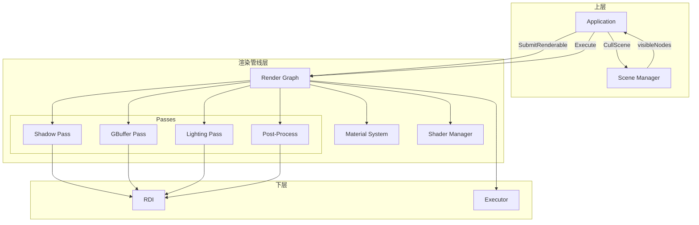
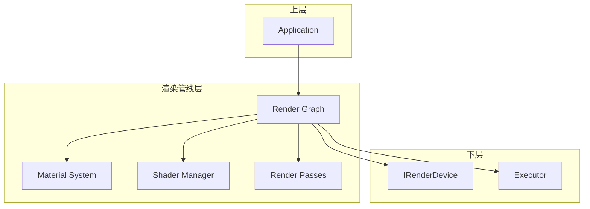
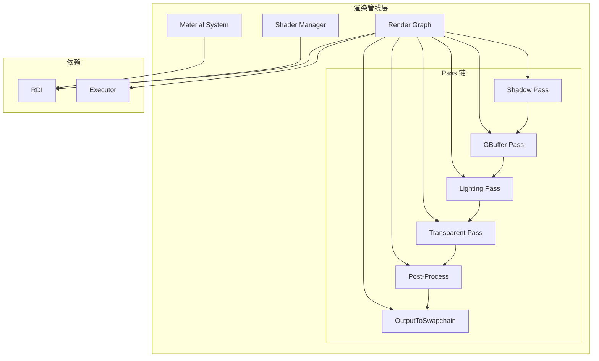

# 渲染管线层设计文档

> 本文档与 [rendering_engine_design.md](./rendering_engine_design.md) 设计对齐，渲染管线层负责 Pass 调度、材质绑定、命令录制。与 [executor_layer_design.md](./executor_layer_design.md) 协作：无依赖 Pass 通过 executor 并行录制。与 [device_abstraction_layer_design.md](./device_abstraction_layer_design.md) 协作：通过 RDI 录制命令并提交。与 [scene_management_layer_design.md](./scene_management_layer_design.md) 协作：接收 CullScene 输出的可见节点，应用层 SubmitRenderable。与 [resource_management_layer_design.md](./resource_management_layer_design.md) 协作：Material、Shader、Texture 由资源层加载。

## 目录
1. [概述与目标](#概述与目标)
2. [问题分析](#问题分析)
3. [设计原则](#设计原则)
4. [架构设计](#架构设计)
5. [核心组件设计](#核心组件设计)
6. [关键接口设计](#关键接口设计)
7. [错误处理与生命周期](#错误处理与生命周期)
8. [与上层集成](#与上层集成)
9. [实现路线图](#实现路线图)

---

## 概述与目标

### 1.1 背景

在 Vulkan+SDL3 渲染引擎架构中，**渲染管线层 (Rendering Pipeline Layer)** 负责将场景数据转换为 GPU 命令，是应用层与设备抽象层之间的**渲染调度中枢**：

- **Render Graph**：声明式渲染管线，管理 Pass 依赖、资源分配、命令录制顺序
- **Material System**：材质级与实例级 DescriptorSet，Pipeline 与纹理绑定
- **Shader Manager**：着色器加载、编译、反射
- **Render Passes**：Shadow、GBuffer、Lighting、Post-Process 等具体 Pass 实现

渲染管线层接收应用层显式提交的可见 Renderable，按 Pass DAG 顺序录制命令并提交到 RDI。

### 1.2 设计目标

1. **声明式管线**：通过 AddPass、DeclareTexture 等声明依赖，Compile 时自动分析并分配资源
2. **显式提交**：应用层 CullScene 后 SubmitRenderable，RG 不主动拉取场景数据
3. **Pass DAG**：Pass 间依赖构成 DAG，无依赖的 Pass 可并行录制
4. **帧流水线**：WaitPrevFrameFence → Acquire → Record → Submit，Present 由 Run 在 Execute 之后调用
5. **材质双级**：材质级 DescriptorSet 共享，实例级池化并于帧末回收

### 1.3 适用范围

- 应用层（OnRender 中 SubmitRenderable 并 Execute）
- 场景管理层（CullScene 输出供 SubmitRenderable 使用）
- 资源管理层（Material、Shader、Texture 由资源层加载）

---

## 问题分析

### 2.1 管线与资源依赖

| Pass | 读入 | 写出 | 依赖 |
|------|------|------|------|
| Shadow | - | ShadowMap | - |
| GBuffer | ShadowMap | Albedo, Normal, Depth | Shadow |
| Lighting | GBuffer, ShadowMap | Lighting | GBuffer, Shadow |
| PostProcess | Lighting | FinalColor | Lighting |
| Output | FinalColor | Swapchain | PostProcess |

### 2.2 每帧流程

```
OnRender():
  1. CullScene(camera) → visibleNodes
  2. ClearSubmitted()
  3. for node in visibleNodes: SubmitRenderable(node->GetRenderable(), worldMatrix, passFlags)
  4. Execute(device)

Execute(device):
  1. WaitForFence(frameFence)
  2. ResetFence(frameFence)
  3. imageIndex = AcquireNextImage()
  4. BuildFrameDrawList()  // 整理 submittedDraws_
  5. 按 DAG 拓扑序 Record Passes（无依赖可并行）
  6. Submit(cmdLists, waitSem, signalSem, fence)
  7. Present() 由 Run 在 Execute 返回后调用
```

### 2.3 渲染管线层典型数据流



---

## 设计原则

### 3.1 核心原则

1. **声明式**：Pass 声明 Read/Write 资源，Compile 时自动分析依赖与分配
2. **显式提交**：不主动拉取场景，应用层负责 CullScene 与 SubmitRenderable
3. **按 PassFlags 过滤**：Shadow 用 ShadowCaster，GBuffer 用 Opaque，Transparent 用 Transparent
4. **帧末回收**：Execute 结束时 ReleaseAllInstanceDescriptorSets
5. **并行录制**：无依赖 Pass 通过 executor 并行录制，每线程独立 CommandList

### 3.2 分层设计



---

## 架构设计

### 4.1 组件关系图



### 4.2 Pass DAG 与并行

```
Shadow ─┬─► GBuffer ─► Lighting ─► Transparent ─► PostProcess ─► Output
        │
        └─► (Shadow 与其他 Pass 无依赖时可并行开始)
```

- 按拓扑序分组：Shadow 先执行；GBuffer 依赖 Shadow；Lighting 依赖 GBuffer；依此类推
- 同组内无依赖的 Pass 可并行录制（如多光源时多个 Shadow Pass）

---

## 核心组件设计

### 5.1 SubmittedDraw 与 RenderPassContext

```cpp
struct SubmittedDraw {
    Renderable* renderable;
    glm::mat4 worldTransform;
    PassFlags passFlags;  // ShadowCaster|Opaque|Transparent
};

struct RenderPassContext {
    const std::vector<SubmittedDraw>& GetSubmittedDraws() const;
    
    // 按 Pass 过滤：过滤条件 (draw.passFlags & pass) != 0
    std::vector<SubmittedDraw> GetDrawsForPass(PassFlags pass) const;
};
```

### 5.2 RenderPassBuilder

```cpp
// RG 内部资源句柄（逻辑句柄，Compile 时映射为 RDI TextureHandle/BufferHandle）
using RGResourceHandle = uint64_t;

class RenderPassBuilder {
public:
    void WriteColor(uint32_t slot, RGResourceHandle texture);
    void WriteDepth(RGResourceHandle texture);
    void ReadTexture(RGResourceHandle texture);
    void WriteSwapchain();  // 声明写入当前 back buffer
};
```

### 5.3 RenderGraph

```cpp
using RenderPassSetup = std::function<void(RenderPassBuilder&)>;
using RenderPassExecute = std::function<void(const RenderPassContext&, CommandList&)>;

class RenderGraph {
public:
    explicit RenderGraph(RenderTaskScheduler* scheduler = nullptr);
    void SetScheduler(RenderTaskScheduler* scheduler);
    
    // 声明资源（返回 RG 内部句柄，Compile 时映射为 RDI 资源）
    RGResourceHandle DeclareTexture(const std::string& name, const TextureDesc& desc);
    RGResourceHandle DeclareBuffer(const std::string& name, const BufferDesc& desc);
    
    // 添加 Pass
    RenderPassHandle AddPass(const std::string& name,
                             RenderPassSetup setup,
                             RenderPassExecute execute);
    
    // 应用层显式提交
    void SubmitRenderable(Renderable* renderable, const glm::mat4& worldTransform,
                         PassFlags passFlags = PassFlags::All);
    void ClearSubmitted();
    
    // 编译与执行
    void Compile(IRenderDevice* device);   // 分辨率/管线变化时调用
    void Execute(IRenderDevice* device);  // 每帧调用
    
    // 设置分辨率（Compile 前调用，影响 DeclareTexture 的尺寸）
    void SetResolution(uint32_t width, uint32_t height);
    
private:
    void BuildFrameDrawList();
    void RecordPasses(IRenderDevice* device);
    void ReleaseFrameResources();  // 帧末回收实例级 DescriptorSet
    
    std::vector<SubmittedDraw> submittedDraws_;
    std::vector<RenderPass> passes_;
    std::unordered_map<std::string, RenderResource> resources_;
    std::vector<RenderPassHandle> topologicalOrder_;
    RenderTaskScheduler* scheduler_ = nullptr;
    
    // 帧流水线
    std::vector<FenceHandle> frameFences_;
    SemaphoreHandle acquireSemaphore_;
    SemaphoreHandle renderCompleteSemaphore_;
    uint32_t currentFrameIndex_ = 0;
    static constexpr uint32_t kMaxFramesInFlight = 3;
};
```

### 5.4 Execute 流程

```cpp
void RenderGraph::Execute(IRenderDevice* device) {
    device->WaitForFence(frameFences_[currentFrameIndex_]);
    device->ResetFence(frameFences_[currentFrameIndex_]);
    
    uint32_t imageIndex = device->AcquireNextImage();
    
    BuildFrameDrawList();
    
    std::vector<CommandList*> cmdLists = RecordPasses(device);
    
    device->Submit(cmdLists,
                  {acquireSemaphore_},
                  {renderCompleteSemaphore_},
                  frameFences_[currentFrameIndex_]);
    
    ReleaseFrameResources();
    
    currentFrameIndex_ = (currentFrameIndex_ + 1) % kMaxFramesInFlight;
}
```

### 5.5 Material System

```cpp
class Material {
public:
    void SetTexture(const std::string& name, Texture* texture);
    void SetParameter(const std::string& name, const void* data, size_t size);
    
    Shader* GetShader() const { return shader_; }
    PipelineHandle GetPipeline() const { return pipeline_; }
    
    // 材质级：同一材质所有实例共享
    DescriptorSetHandle GetMaterialDescriptorSet() const { return materialDescriptorSet_; }
    
    // 实例级：每绘制调用可单独绑定（per-instance 数据）
    // Acquire 在 Draw 时调用；Release 由 RenderGraph::ReleaseFrameResources 统一回收
    DescriptorSetHandle AcquireInstanceDescriptorSet(const void* instanceData, size_t size);
    void ReleaseAllInstanceDescriptorSets();
    
private:
    Shader* shader_;
    PipelineHandle pipeline_;
    DescriptorSetHandle materialDescriptorSet_;
    std::unordered_map<std::string, MaterialParameter> parameters_;
    std::vector<DescriptorSetHandle> instanceDescriptorPool_;
};

class PBRMaterial : public Material {
public:
    void SetAlbedo(Texture* tex);
    void SetNormal(Texture* tex);
    void SetMetallic(float value);
    void SetRoughness(float value);
    void SetAO(Texture* tex);
    void SetEmissive(Texture* tex);
};
```

### 5.6 Renderable::Draw 与 Material 绑定

```cpp
void StaticMesh::Draw(CommandList& cmd, const glm::mat4& worldTransform) {
    cmd.BindPipeline(material_->GetPipeline());
    cmd.BindDescriptorSet(0, material_->GetMaterialDescriptorSet());
    
    auto instanceSet = material_->AcquireInstanceDescriptorSet(&worldTransform, sizeof(glm::mat4));
    cmd.BindDescriptorSet(1, instanceSet);
    
    cmd.SetPushConstants(&worldTransform, sizeof(glm::mat4));
    cmd.BindVertexBuffer(0, mesh_->GetVertexBuffer());
    cmd.BindIndexBuffer(mesh_->GetIndexBuffer());
    cmd.DrawIndexed(mesh_->GetIndexCount());
}
```

### 5.7 Shader Manager

```cpp
class ShaderManager {
public:
    ShaderHandle LoadShader(const std::string& path, ShaderStage stage, IRenderDevice* device);
    ShaderHandle GetShader(const std::string& name) const;
    
    // 热重载
    void ReloadShader(const std::string& path);
    
private:
    std::unordered_map<std::string, ShaderHandle> shaders_;
    IRenderDevice* device_;
};
```

### 5.8 并行录制

```cpp
void RenderGraph::RecordPasses(IRenderDevice* device) {
    std::vector<CommandList*> cmdLists;
    
    for (auto& group : GetTopologicalGroups()) {
        std::vector<std::future<CommandList*>> futures;
        for (size_t i = 0; i < group.size(); ++i) {
            futures.push_back(scheduler_->Submit([&, i]() {
                auto* cmd = device->BeginCommandList(static_cast<uint32_t>(i));
                group[i]->Execute(renderPassContext_, *cmd);
                device->EndCommandList(cmd);
                return cmd;
            }));
        }
        for (auto& f : futures)
            cmdLists.push_back(f.get());
    }
    
    return cmdLists;
}
```

### 5.9 Setup 示例（Deferred + Shadow）

```cpp
void SetupRenderGraph(RenderGraph& rg) {
    rg.SetResolution(1920, 1080);
    
    auto shadowMap = rg.DeclareTexture("ShadowMap", {2048, 2048, Format::D32});
    rg.AddPass("ShadowPass",
        [&](RenderPassBuilder& b) { b.WriteDepth(shadowMap); },
        [](const RenderPassContext& ctx, CommandList& cmd) {
            for (const auto& draw : ctx.GetDrawsForPass(PassFlags::ShadowCaster))
                draw.renderable->Draw(cmd, draw.worldTransform);
        });
    
    auto gbufferAlbedo = rg.DeclareTexture("GBuffer.Albedo", {1920, 1080, Format::RGBA8});
    auto gbufferNormal = rg.DeclareTexture("GBuffer.Normal", {1920, 1080, Format::RGBA16F});
    auto gbufferDepth = rg.DeclareTexture("GBuffer.Depth", {1920, 1080, Format::D24S8});
    
    rg.AddPass("GBufferPass",
        [&](RenderPassBuilder& b) {
            b.WriteColor(0, gbufferAlbedo);
            b.WriteColor(1, gbufferNormal);
            b.WriteDepth(gbufferDepth);
            b.ReadTexture(shadowMap);
        },
        [](const RenderPassContext& ctx, CommandList& cmd) {
            for (const auto& draw : ctx.GetDrawsForPass(PassFlags::Opaque))
                draw.renderable->Draw(cmd, draw.worldTransform);
        });
    
    auto lightingResult = rg.DeclareTexture("Lighting", {1920, 1080, Format::RGBA16F});
    rg.AddPass("LightingPass",
        [&](RenderPassBuilder& b) {
            b.ReadTexture(gbufferAlbedo);
            b.ReadTexture(gbufferNormal);
            b.ReadTexture(gbufferDepth);
            b.ReadTexture(shadowMap);
            b.WriteColor(0, lightingResult);
        },
        [](const RenderPassContext& ctx, CommandList& cmd) {
            // PBR 光照：全屏三角形 + 光照 UBO
        });
    
    auto finalColor = rg.DeclareTexture("FinalColor", {1920, 1080, Format::RGBA8});
    rg.AddPass("PostProcess",
        [&](RenderPassBuilder& b) {
            b.ReadTexture(lightingResult);
            b.WriteColor(0, finalColor);
        },
        [](const RenderPassContext& ctx, CommandList& cmd) {
            // Bloom, Tone Mapping, FXAA
        });
    
    rg.AddPass("OutputToSwapchain",
        [&](RenderPassBuilder& b) {
            b.ReadTexture(finalColor);
            b.WriteSwapchain();
        },
        [](const RenderPassContext& ctx, CommandList& cmd) {
            // Blit finalColor → GetBackBuffer()
        });
}
```

---

## 关键接口设计

### 6.1 应用层 OnRender 流程

```cpp
void MyGame::OnRender() override {
    auto visibleNodes = engine->GetSceneManager()->CullScene(camera);
    auto* rg = engine->GetRenderGraph();
    rg->ClearSubmitted();
    
    for (auto* node : visibleNodes) {
        if (auto* r = node->GetRenderable())
            rg->SubmitRenderable(r, node->GetWorldMatrix(), node->GetPassFlags());
    }
    
    rg->Execute(engine->GetRenderDevice());
}
```

### 6.2 Present 调用位置

```cpp
// RenderEngine::Run 中
void RenderEngine::Run(Application* app) {
    while (!shouldStop) {
        inputManager_->Update();
        entityManager_->Update(deltaTime);
        sceneManager_->Update(deltaTime);
        app->OnUpdate(deltaTime);
        app->OnRender();              // 内部调用 rg->Execute()
        renderDevice_->Present();      // Execute 之后由 Run 调用
    }
}
```

### 6.3 多相机与多视口

```cpp
// 方案 A：每相机独立 Execute 到不同 RenderTarget
for (size_t i = 0; i < cameras.size(); ++i) {
    auto visible = sceneManager->CullScene(cameras[i]);
    rg->ClearSubmitted();
    for (auto* node : visible)
        if (auto* r = node->GetRenderable())
            rg->SubmitRenderable(r, node->GetWorldMatrix(), node->GetPassFlags());
    rg->Execute(engine->GetRenderDevice(), renderTargets[i]);
}
```

---

## 错误处理与生命周期

### 7.1 Compile 失败

- Compile 在分辨率变化或首次 Setup 时调用
- 失败时返回 false 或抛出，GetLastError 获取原因
- 资源分配失败时保证已分配资源可释放

### 7.2 实例级 DescriptorSet 回收

- 每帧 Execute 结束时调用 ReleaseFrameResources
- 遍历本帧 SubmittedDraws 中的 Material，调用 ReleaseAllInstanceDescriptorSets
- 池化复用，避免每帧大量分配

### 7.3 帧流水线同步

- 每帧对应 Fence，Wait 上一帧 Fence 后再 Acquire
- Acquire 返回的 semaphore 用于 Submit 时 wait
- Submit 时 signal renderCompleteSemaphore，供 Present 使用（若 Present 需要）

---

## 与上层集成

### 8.1 RenderEngine 初始化

```cpp
bool RenderEngine::Initialize(const Config& config) {
    renderGraph_ = std::make_unique<RenderGraph>();
    renderGraph_->SetResolution(config.width, config.height);
    SetupRenderGraph(*renderGraph_);
    renderGraph_->Compile(renderDevice_.get());
}
```

### 8.2 依赖关系

| 上层模块 | 依赖渲染管线层 |
|----------|----------------|
| Application | RenderGraph (SubmitRenderable, Execute) |
| Scene Manager | CullScene 输出供 SubmitRenderable |

| 渲染管线层依赖 | 模块 |
|----------------|------|
| IRenderDevice | 设备抽象层 |
| RenderTaskScheduler | 执行器层 |
| Material, Texture, Shader | 资源管理层 |
| Renderable | 场景管理层 |

---

## 实现路线图

### Phase 1：Render Graph 基础（1–2 周）
- [ ] SubmittedDraw、RenderPassContext
- [ ] AddPass、DeclareTexture 声明式接口
- [ ] Compile：依赖分析、资源分配
- [ ] Execute：单线程录制、简单 Forward Pass

### Phase 2：材质系统（1–2 周）
- [ ] Material 基类、材质级 DescriptorSet
- [ ] 实例级 DescriptorSet 池化
- [ ] PBRMaterial
- [ ] ReleaseFrameResources 帧末回收

### Phase 3：Deferred 管线（2 周）
- [ ] Shadow Pass
- [ ] GBuffer Pass
- [ ] Lighting Pass
- [ ] Post-Process（Bloom, Tone Mapping）
- [ ] OutputToSwapchain

### Phase 4：并行与优化（1–2 周）
- [ ] Pass DAG 拓扑序分组
- [ ] 多线程命令录制（ParallelRecordCommands）
- [ ] GPU Instancing 支持

### Phase 5：高级特性（1–2 周）
- [ ] 多相机/多视口
- [ ] Transparent Pass（排序）
- [ ] 着色器热重载集成

---

## 附录：资源句柄与 Pass 依赖

### A.1 RenderGraph 内部 ResourceHandle

- 与 RDI 的 TextureHandle/BufferHandle 区分：RenderGraph 内部使用逻辑句柄（字符串名或 ID）
- Compile 时解析依赖，分配实际 GPU 资源并建立映射

### A.2 Pass 依赖推导

- ReadTexture(A) 且 WriteTexture(A) 的 Pass 之间：写者先于读者
- 同一纹理多写者：需显式顺序或合并 Pass

### A.3 技术栈

- **glm**：数学库
- **executor**：并行录制调度

---

## 总结

渲染管线层是渲染引擎中负责**Pass 调度、材质绑定、命令录制**的中枢，主要包含：

1. **Render Graph**：声明式管线、SubmitRenderable、Compile、Execute
2. **Material System**：材质级/实例级 DescriptorSet、PBRMaterial
3. **Shader Manager**：着色器加载与热重载
4. **Render Passes**：Shadow、GBuffer、Lighting、Post-Process、Output

通过**声明式、显式提交、Pass DAG、帧末回收**等设计，实现管线清晰、资源自动管理、支持并行录制的目标。
