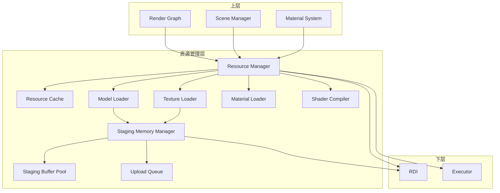
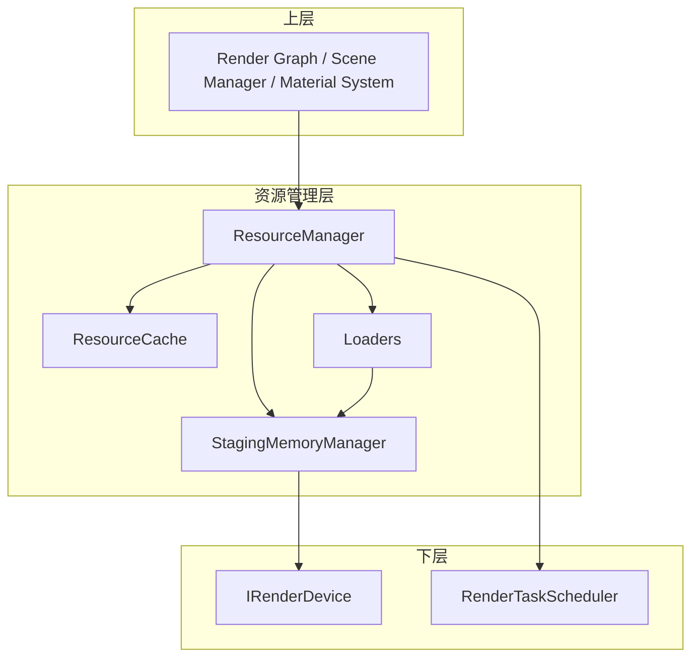
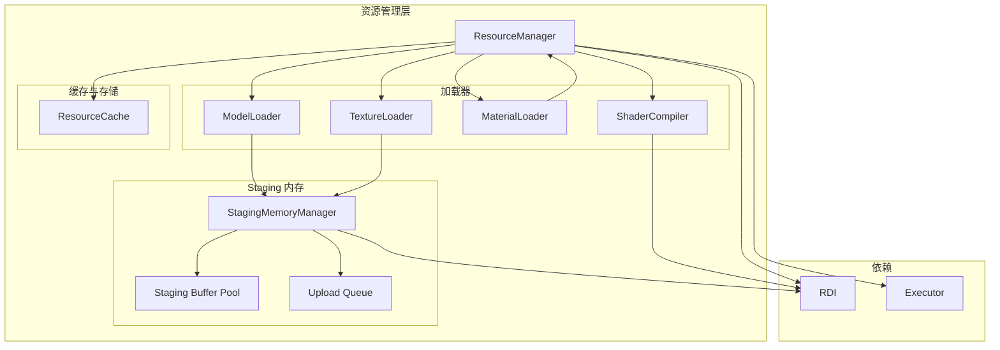

# 资源管理层设计文档

> 本文档与 [rendering_engine_design.md](./rendering_engine_design.md) 设计对齐，资源管理层为渲染管线、场景管理等上层提供统一的资源加载与缓存。与 [executor_layer_design.md](./executor_layer_design.md) 协作：异步加载通过 executor 在后台执行。与 [device_abstraction_layer_design.md](./device_abstraction_layer_design.md) 协作：GPU 资源通过 RDI 创建，Staging 上传通过 RDI 提交 Copy 命令。

## 目录
1. [概述与目标](#概述与目标)
2. [问题分析](#问题分析)
3. [设计原则](#设计原则)
4. [架构设计](#架构设计)
5. [核心组件设计](#核心组件设计)
6. [关键接口设计](#关键接口设计)
7. [错误处理与生命周期](#错误处理与生命周期)
8. [与上层集成](#与上层集成)
9. [实现路线图](#实现路线图)

---

## 概述与目标

### 1.1 背景

在 Vulkan+SDL3 渲染引擎架构中，**资源管理层 (Resource Management Layer)** 位于设备抽象层之上，负责：

- **资源加载**：从磁盘/网络加载模型、纹理、着色器、材质等资源
- **资源缓存**：统一缓存已加载资源，支持引用计数与延迟释放
- **CPU→GPU 上传**：通过 Staging Memory Manager 管理暂存缓冲池与上传队列
- **异步加载**：利用 executor 在后台线程加载，主循环不阻塞

资源管理层是渲染管线、场景管理、材质系统等上层与**原始资源数据**之间的桥梁，将文件路径转换为可用的 GPU 资源（Buffer、Texture、Mesh、Material 等）。

### 1.2 设计目标

1. **非阻塞主循环**：异步加载通过 executor 在后台执行，LoadAsync 返回 Future，不阻塞主线程
2. **占位符策略**：资源未就绪时使用占位符或跳过绘制，并触发 LoadAsync（若尚未触发）
3. **统一缓存**：所有资源类型通过 ResourceCache 统一管理，支持路径去重、引用计数
4. **Staging 复用**：Staging Buffer 池化，避免每帧大量分配；Upload Queue 与 RDI 配合完成 CPU→GPU 传输
5. **热重载**：开发期支持文件变化侦测与资源热重载

### 1.3 适用范围

- 渲染管线层（材质、着色器、纹理由资源层加载）
- 场景管理层（模型、Mesh 由资源层加载）
- 应用层（通过 ResourceManager 的 Load/LoadAsync 获取资源）

---

## 问题分析

### 2.1 资源加载流程

| 阶段 | 位置 | 职责 |
|------|------|------|
| 磁盘 I/O | Loader | 读取文件，解析格式（glTF、PNG、JSON 等） |
| CPU 处理 | Loader | 解码、生成顶点/索引、Mipmap 预计算 |
| 上传 | Staging Manager | 创建 Staging Buffer，提交 Copy 命令 |
| GPU 资源 | RDI | 创建 GPU Buffer/Texture，接收上传数据 |
| 缓存 | ResourceCache | 登记句柄，管理引用计数 |

### 2.2 异步与同步

- **同步加载**：`Load(path)` 阻塞直到完成，适合启动时关键资源
- **异步加载**：`LoadAsync(path)` 返回 Future，适合运行时动态加载
- **资源检查**：在 SubmitRenderable/Draw 时隐式进行，未就绪则用占位符并触发 LoadAsync

### 2.3 资源依赖

- **材质依赖纹理**：MaterialLoader 解析 JSON 时引用 Texture 路径，需 Load 纹理或加入依赖队列
- **模型依赖材质**：glTF 引用材质路径，可延迟解析或预加载
- **着色器**：独立资源，无依赖；可被 Material 引用

### 2.4 资源管理层典型数据流



---

## 设计原则

### 3.1 核心原则

1. **句柄化资源**：所有资源通过 `ResourceHandle<T>` 引用，不暴露裸指针（除 Get 返回的临时访问）
2. **异步优先**：LoadAsync 为默认推荐；Load 仅用于启动时或必须同步的场景
3. **占位符不阻塞**：未就绪时使用占位符或跳过，并触发异步加载；主循环永不因资源等待而卡顿
4. **Staging 池化**：Staging Buffer 复用，避免频繁分配；Upload Queue 按帧提交，与 GPU 提交顺序一致
5. **依赖下沉**：Loader 内部处理格式解析；上层仅关心路径与句柄

### 3.2 分层设计



---

## 架构设计

### 4.1 组件关系图



### 4.2 资源类型与 Loader 映射

| 资源类型 | 扩展名 | Loader | 输出 |
|----------|--------|--------|------|
| Mesh | .gltf, .obj, .fbx | ModelLoader | Mesh |
| Texture | .png, .jpg, .ktx, .dds | TextureLoader | Texture |
| Material | .json | MaterialLoader | Material |
| Shader | .vert, .frag, .spv | ShaderCompiler | Shader |

---

## 核心组件设计

### 5.1 资源句柄类型

```cpp
template<typename T>
struct ResourceHandle {
    uint64_t id = 0;
    
    bool IsValid() const { return id != 0; }
    bool operator==(const ResourceHandle& other) const { return id == other.id; }
    bool operator!=(const ResourceHandle& other) const { return id != other.id; }
};

// 类型擦除的句柄（用于 Unload 等通用接口）
struct ResourceHandleAny {
    uint64_t id = 0;
    std::type_index typeId;
};

template<typename T>
ResourceHandleAny ToAny(ResourceHandle<T> h) {
    return {h.id, typeid(T)};
}
```

### 5.2 ResourceManager

```cpp
class ResourceManager {
public:
    explicit ResourceManager(RenderTaskScheduler* scheduler,
                             IRenderDevice* device,
                             StagingMemoryManager* stagingMgr = nullptr);
    
    // 异步加载
    template<typename T>
    Future<ResourceHandle<T>> LoadAsync(const std::string& path);
    
    // 同步加载（失败返回空句柄，可通过 GetLastError 获取原因）
    template<typename T>
    ResourceHandle<T> Load(const std::string& path);
    
    // 获取资源（未就绪返回 nullptr）
    template<typename T>
    T* Get(ResourceHandle<T> handle);
    
    // 检查资源是否就绪
    template<typename T>
    bool IsReady(ResourceHandle<T> handle) const;
    
    // 释放资源
    void Unload(ResourceHandleAny handle);
    
    // 资源热重载
    void EnableHotReload(bool enable);
    void ProcessHotReload();  // 每帧调用，检查文件变化
    
    std::string GetLastError() const;
    
    // 获取占位符（供 Draw 时未就绪使用）
    Mesh* GetPlaceholderMesh();
    Texture* GetPlaceholderTexture();
    Material* GetPlaceholderMaterial();
    
    // 注册 Loader
    void RegisterLoader(std::unique_ptr<IResourceLoader> loader);
    
    // 创建占位符资源
    void CreatePlaceholders();
    
private:
    IResourceLoader* FindLoader(const std::string& path, std::type_index typeId);
    ResourceCache cache_;
    std::vector<std::unique_ptr<IResourceLoader>> loaders_;
    RenderTaskScheduler* scheduler_;
    IRenderDevice* device_;
    StagingMemoryManager* stagingMgr_;
    std::string lastError_;
};
```

### 5.3 ResourceCache

```cpp
struct CacheEntry {
    std::any resource;           // 实际资源（Mesh*, Texture*, Material* 等）
    std::string path;
    uint32_t refCount = 0;
    bool isReady = false;         // 异步加载完成时标记
    std::type_index typeId;
};

class ResourceCache {
public:
    template<typename T>
    ResourceHandle<T> Register(const std::string& path, T* resource, bool ready = true);
    
    // 预注册占位条目（异步加载前调用，resource 稍后通过 SetResource 设置）
    template<typename T>
    ResourceHandle<T> RegisterPlaceholder(const std::string& path);
    
    template<typename T>
    T* Get(ResourceHandle<T> handle);
    
    template<typename T>
    bool IsReady(ResourceHandle<T> handle) const;
    
    void SetResource(ResourceHandleAny handle, std::any resource);
    void SetReady(ResourceHandleAny handle);
    
    void AddRef(ResourceHandleAny handle);
    void Release(ResourceHandleAny handle);
    
    uint64_t GetId(ResourceHandleAny handle) const { return handle.id; }
    
    // 路径查找
    std::optional<ResourceHandleAny> FindByPath(const std::string& path, std::type_index typeId);
    
private:
    std::unordered_map<uint64_t, CacheEntry> entries_;
    std::unordered_map<std::string, uint64_t> pathToId_;
    uint64_t nextId_ = 1;
    std::mutex mutex_;
};
```

### 5.4 IResourceLoader 接口

```cpp
class IResourceLoader {
public:
    virtual ~IResourceLoader() = default;
    
    // 是否支持该路径
    virtual bool Supports(const std::string& path) const = 0;
    
    // 同步加载（失败返回 nullptr）
    virtual std::any Load(const std::string& path, ResourceLoadContext& ctx) = 0;
    
    // 资源类型
    virtual std::type_index GetResourceType() const = 0;
};

struct ResourceLoadContext {
    IRenderDevice* device;
    StagingMemoryManager* stagingMgr;
    ResourceManager* resourceManager;  // 用于加载依赖资源（如 Material 依赖 Texture）
};
```

### 5.5 ModelLoader

```cpp
class ModelLoader : public IResourceLoader {
public:
    bool Supports(const std::string& path) const override;
    std::any Load(const std::string& path, ResourceLoadContext& ctx) override;
    std::type_index GetResourceType() const override { return typeid(Mesh); }
    
private:
    // 支持 glTF, OBJ, FBX 等格式
    // 使用 tinygltf / assimp 等库解析
    std::unique_ptr<Mesh> LoadGLTF(const std::string& path, ResourceLoadContext& ctx);
    std::unique_ptr<Mesh> LoadOBJ(const std::string& path, ResourceLoadContext& ctx);
};
```

### 5.6 TextureLoader

```cpp
class TextureLoader : public IResourceLoader {
public:
    bool Supports(const std::string& path) const override;
    std::any Load(const std::string& path, ResourceLoadContext& ctx) override;
    std::type_index GetResourceType() const override { return typeid(Texture); }
    
private:
    // 支持 PNG, JPG, KTX, DDS (BC, ASTC, ETC2 等压缩格式)
    // 使用 stb_image / basis_universal 等库
    std::unique_ptr<Texture> LoadSTB(const std::string& path, ResourceLoadContext& ctx);
    std::unique_ptr<Texture> LoadKTX(const std::string& path, ResourceLoadContext& ctx);
};
```

### 5.7 MaterialLoader

```cpp
class MaterialLoader : public IResourceLoader {
public:
    bool Supports(const std::string& path) const override;
    std::any Load(const std::string& path, ResourceLoadContext& ctx) override;
    std::type_index GetResourceType() const override { return typeid(Material); }
    
private:
    // 从 JSON 解析材质定义，引用 Texture 等资源
    // 格式：{ "albedo": "textures/brick.png", "metallic": 0.2, ... }
    std::unique_ptr<Material> LoadJSON(const std::string& path, ResourceLoadContext& ctx);
};
```

### 5.8 ShaderCompiler

```cpp
class ShaderCompiler {
public:
    // 从文件路径加载并编译（GLSL / SPIR-V）
    ShaderHandle Compile(const std::string& path, ShaderStage stage, IRenderDevice* device);
    
    // 热重载时重新编译
    ShaderHandle Recompile(const std::string& path, ShaderStage stage, IRenderDevice* device);
    
    // 支持 .vert, .frag, .comp, .spv
    std::vector<uint8_t> LoadSPIRV(const std::string& path);
    std::vector<uint8_t> CompileGLSLToSPIRV(const std::string& path, ShaderStage stage);
};
```

### 5.9 StagingMemoryManager

```cpp
class StagingMemoryManager {
public:
    explicit StagingMemoryManager(IRenderDevice* device);
    
    // 分配 Staging Buffer（用于 CPU→GPU 上传）
    struct StagingAllocation {
        BufferHandle buffer;
        void* mappedPtr;
        size_t size;
        size_t offset;
    };
    StagingAllocation Allocate(size_t size);
    void Free(const StagingAllocation& alloc);
    
    // 提交上传命令（Copy Buffer → Texture/Buffer）
    void SubmitUpload(CommandList* cmd, const StagingAllocation& src,
                      TextureHandle dstTexture, uint32_t mipLevel = 0);
    void SubmitUpload(CommandList* cmd, const StagingAllocation& src,
                      BufferHandle dstBuffer, size_t dstOffset = 0);
    
    // 与 Upload Queue 协同：每帧收集 Copy 命令，在 Execute 前提交
    void FlushUploads(IRenderDevice* device);
    
private:
    IRenderDevice* device_;
    std::vector<BufferHandle> stagingPool_;
    size_t poolSize_ = 64 * 1024 * 1024;  // 64MB 默认
    size_t used_;
    std::vector<std::function<void(CommandList*)>> pendingUploads_;
};
```

### 5.10 异步加载流程

```cpp
template<typename T>
Future<ResourceHandle<T>> ResourceManager::LoadAsync(const std::string& path) {
    // 1. 检查缓存
    if (auto existing = cache_.FindByPath(path, typeid(T))) {
        return scheduler_->MakeReadyFuture(ResourceHandle<T>{existing->id});
    }
    
    // 2. 预注册占位条目（refCount=0，isReady=false）
    auto handle = cache_.RegisterPlaceholder<T>(path);
    
    // 3. 提交异步任务：加载完成后登记资源并返回 handle
    return scheduler_->Submit([this, path, handle]() -> ResourceHandle<T> {
        auto* loader = FindLoader(path, typeid(T));
        if (!loader) return {};
        
        ResourceLoadContext ctx{device_, stagingMgr_, this};
        auto resource = loader->Load(path, ctx);
        if (resource.has_value()) {
            cache_.SetResource(ToAny(handle), std::move(resource));
            cache_.SetReady(ToAny(handle));
        }
        return handle;
    });
}
```

### 5.11 占位符与 Draw 时检查

```cpp
// Renderable::Draw 时（示例）
void StaticMesh::Draw(CommandList& cmd, const glm::mat4& worldTransform) {
    auto* mesh = meshHandle_.IsValid() ? resMgr_->Get(meshHandle_) : nullptr;
    if (!mesh) {
        mesh = resMgr_->GetPlaceholderMesh();
        if (!resMgr_->IsReady(meshHandle_)) {
            resMgr_->LoadAsync<Mesh>(meshPath_);  // 若尚未触发
        }
    }
    
    auto* material = matHandle_.IsValid() ? resMgr_->Get(matHandle_) : nullptr;
    if (!material) {
        material = resMgr_->GetPlaceholderMaterial();
        if (!resMgr_->IsReady(matHandle_)) {
            resMgr_->LoadAsync<Material>(matPath_);
        }
    }
    
    // 使用 mesh 和 material 绘制...
}
```

---

## 关键接口设计

### 6.1 资源路径与别名

```cpp
// 资源路径约定
// - 相对路径：相对于 assetPath（如 "models/brick.gltf"）
// - 别名：可配置 path -> alias 映射
void ResourceManager::SetAssetPath(const std::string& path);
void ResourceManager::AddPathAlias(const std::string& alias, const std::string& path);

std::string ResourceManager::ResolvePath(const std::string& path) const;
```

### 6.2 预加载与批量加载

```cpp
// 预加载一批资源（用于场景切换前）
void ResourceManager::Preload(const std::vector<std::string>& paths);

// 批量异步加载
template<typename T>
std::vector<Future<ResourceHandle<T>>> ResourceManager::LoadAsyncBatch(
    const std::vector<std::string>& paths);
```

### 6.3 资源依赖解析

```cpp
// MaterialLoader 内部示例
std::unique_ptr<Material> MaterialLoader::LoadJSON(const std::string& path,
                                                   ResourceLoadContext& ctx) {
    auto json = ParseJSON(path);
    if (!json) return nullptr;
    
    auto* material = new Material();
    
    // 解析依赖的纹理
    for (auto& texPath : json["textures"]) {
        auto handle = ctx.resourceManager->Load<Texture>(texPath);
        material->SetTexture(handle);
    }
    
    // 解析其他参数...
    return std::unique_ptr<Material>(material);
}
```

---

## 错误处理与生命周期

### 7.1 加载失败

- `Load()` 返回空句柄，`GetLastError()` 返回原因
- `LoadAsync()` 的 Future 可通过 `valid()` 或异常/错误状态传递失败
- 失败时不缓存，避免重复加载失败路径

### 7.2 引用计数

- `Register` 时 refCount=1；`AddRef` 增；`Release` 减
- refCount=0 时延迟释放（可加入待释放队列，下一帧统一 Destroy）
- 避免渲染中使用时被释放：释放仅在帧边界或显式 Unload 时

### 7.3 Staging Buffer 生命周期

- 分配：Allocate 从池中取或扩展
- 使用：Upload 提交后，需等待 GPU 完成再回收
- 回收：与 Fence 关联，GPU 完成时 Free 回池

### 7.4 热重载

- 启用时：每帧检查已加载资源的文件时间戳
- 变化时：重新 Load，替换 Cache 中的资源；若正在使用则需同步（如等待下一帧）
- 材质/着色器热重载：替换后重新创建 Pipeline

---

## 与上层集成

### 8.1 RenderEngine 初始化

```cpp
bool RenderEngine::Initialize(const Config& config) {
    stagingMgr_ = std::make_unique<StagingMemoryManager>(renderDevice_.get());
    resourceManager_ = std::make_unique<ResourceManager>(
        scheduler_.get(), renderDevice_.get(), stagingMgr_.get());
    resourceManager_->SetAssetPath(config.assetPath);
    
    // 注册 Loader
    resourceManager_->RegisterLoader(std::make_unique<ModelLoader>());
    resourceManager_->RegisterLoader(std::make_unique<TextureLoader>());
    resourceManager_->RegisterLoader(std::make_unique<MaterialLoader>());
    
    // 创建占位符
    resourceManager_->CreatePlaceholders();
}
```

### 8.2 主循环中的资源处理

```cpp
void RenderEngine::Run(Application* app) {
    while (!shouldStop) {
        inputManager_->Update();
        entityManager_->Update(deltaTime);
        sceneManager_->Update(deltaTime);
        app->OnUpdate(deltaTime);
        
        // 处理热重载
        resourceManager_->ProcessHotReload();
        
        // 处理加载完成回调（可选）
        resourceManager_->ProcessLoadedCallbacks();
        
        app->OnRender();
        renderDevice_->Present();
    }
}
```

### 8.3 依赖关系

| 上层模块 | 依赖资源管理层 |
|----------|----------------|
| Render Graph | Material, Texture, Shader |
| Scene Manager | Mesh |
| Application | 所有资源类型 |
| Material System | Texture, Shader |

---

## 实现路线图

### Phase 1：基础框架（1–2 周）
- [ ] ResourceHandle、ResourceCache 基础实现
- [ ] ResourceManager 接口与 Loader 注册
- [ ] 同步 Load 实现
- [ ] 简单 TextureLoader（stb_image）
- [ ] 简单 ModelLoader（glTF 顶点/索引）

### Phase 2：异步加载（1–2 周）
- [ ] LoadAsync 与 executor 集成
- [ ] Future 返回与回调
- [ ] 占位符系统
- [ ] Draw 时资源检查与触发加载

### Phase 3：Staging 与上传（1–2 周）
- [ ] StagingMemoryManager 实现
- [ ] Staging Buffer 池化
- [ ] Upload Queue 与 Copy 命令
- [ ] TextureLoader 集成 Staging 上传

### Phase 4：完整 Loader（2 周）
- [ ] 完整 ModelLoader（glTF 材质、纹理引用）
- [ ] MaterialLoader（JSON 解析、依赖加载）
- [ ] ShaderCompiler（GLSL→SPIR-V）
- [ ] 压缩纹理支持（KTX、DDS）

### Phase 5：热重载与优化（1 周）
- [ ] 文件变化侦测
- [ ] 热重载流程
- [ ] 引用计数与延迟释放
- [ ] 性能测试与调优

---

## 附录：Mesh 与 Texture 数据结构

### A.1 Mesh

```cpp
struct Mesh {
    BufferHandle vertexBuffer;
    BufferHandle indexBuffer;
    uint32_t indexCount;
    uint32_t vertexCount;
    PrimitiveTopology topology;
    BoundingBox bounds;
    
    // 子网格（LOD、材质分组）
    struct SubMesh {
        uint32_t indexOffset;
        uint32_t indexCount;
        uint32_t materialIndex;
    };
    std::vector<SubMesh> subMeshes;
};
```

### A.2 Texture

```cpp
struct Texture {
    TextureHandle handle;  // RDI 句柄
    uint32_t width;
    uint32_t height;
    Format format;
    uint32_t mipLevels;
};
```

### A.3 技术栈

- **tinygltf**：glTF 解析
- **stb_image**：PNG/JPG 加载
- **basis_universal**：KTX 压缩纹理
- **assimp**：多格式模型（可选）
- **glslang** / **shaderc**：GLSL→SPIR-V 编译

---

## 总结

资源管理层是渲染引擎中负责**资源加载、缓存、上传**的中枢，主要包含：

1. **ResourceManager**：统一入口，Load/LoadAsync/Get/Unload
2. **ResourceCache**：缓存、引用计数、路径去重
3. **Loader**：ModelLoader、TextureLoader、MaterialLoader、ShaderCompiler
4. **StagingMemoryManager**：Staging Buffer 池、Upload Queue、CPU→GPU 传输

通过**异步加载、占位符、Staging 池化**等设计，实现主循环不阻塞、资源按需加载、与 GPU 高效上传的目标。
