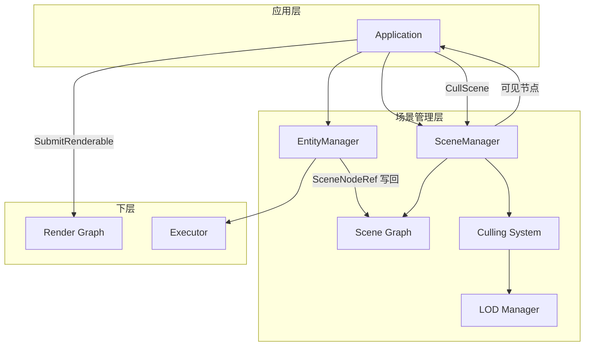
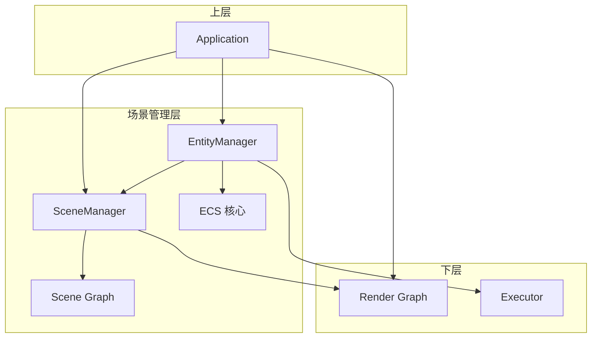
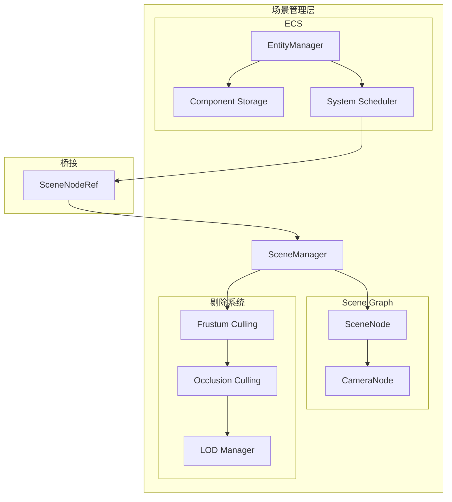

# 场景管理层设计文档

> 本文档与 [rendering_engine_design.md](./rendering_engine_design.md) 设计对齐，场景管理层采用以场景图为主的架构，负责 Transform 层级、剔除、ECS 逻辑桥接。与 [executor_layer_design.md](./executor_layer_design.md) 协作：ECS System 通过 executor 并行执行。与 [resource_management_layer_design.md](./resource_management_layer_design.md) 协作：Renderable 引用 Mesh/Material 由资源层加载。

## 目录
1. [概述与目标](#概述与目标)
2. [问题分析](#问题分析)
3. [设计原则](#设计原则)
4. [架构设计](#架构设计)
5. [核心组件设计](#核心组件设计)
6. [关键接口设计](#关键接口设计)
7. [错误处理与生命周期](#错误处理与生命周期)
8. [与上层集成](#与上层集成)
9. [实现路线图](#实现路线图)

---

## 概述与目标

### 1.1 背景

在 Vulkan+SDL3 渲染引擎架构中，**场景管理层 (Scene Management Layer)** 负责场景逻辑与渲染数据的组织，采用**以场景图为主**的架构：

- **Scene Graph**：负责 Transform 层级、世界矩阵计算、场景剔除、Renderable 管理。所有需要渲染的对象挂载在场景图节点上。
- **ECS**：仅负责游戏逻辑（物理、动画、脚本等），不管理 Transform。逻辑组件通过 Entity 引用 Scene Graph 节点，或通过共享数据与场景交互。
- **Renderable**：负责渲染，由应用层在 `OnRender()` 中从 Scene Graph 获取可见对象，显式提交到 Render Graph。

场景管理层是应用层与渲染管线之间的**场景数据枢纽**，提供 Transform 层级、可见性剔除、LOD 选择等能力。

### 1.2 设计目标

1. **职责清晰**：Scene Graph 管 Transform 与剔除，ECS 管逻辑，二者通过 SceneNodeRef 桥接
2. **更新顺序固定**：ECS::Update → 逻辑系统写回 Scene Graph → SceneManager::Update → OnUpdate → OnRender
3. **生命周期安全**：SceneNodeHandle 句柄化，场景切换时避免悬空引用
4. **剔除一体化**：视锥剔除、遮挡剔除、LOD 选择均内含于 SceneManager::CullScene
5. **多相机支持**：CullScene 可接受多相机，返回按相机分组的可见列表

### 1.3 适用范围

- 应用层（创建场景、提交可见对象到 Render Graph）
- 渲染管线层（接收 CullScene 输出的可见节点，提交 Renderable）
- ECS 层（逻辑系统通过 SceneNodeRef 写回 Transform）

---

## 问题分析

### 2.1 Transform 与逻辑分离

| 维度 | Scene Graph | ECS |
|------|-------------|-----|
| 职责 | Transform 层级、世界矩阵、剔除 | 物理、动画、脚本等逻辑 |
| 数据 | localTransform、worldMatrix | PhysicsComponent、AnimationComponent 等 |
| 写回 | 接收 ECS 系统的 SetLocalTransform | 通过 SceneNodeRef 写回 |

**桥接**：SceneNodeRef 组件存储 SceneNodeHandle，System 通过 `GetNode(sceneMgr)` 解析后调用 `SetLocalTransform`。

### 2.2 写回竞争

- 同一 SceneNode 同一帧内仅应有一个 System 作为「主写者」
- 多 System 写同一节点时，需通过 `GetDependencies()` 建立 DAG，保证先后顺序
- 开发期可选冲突检测：帧末检查多写者无依赖关系的场景

### 2.3 场景切换与悬空引用

- `SetActiveScene` 销毁旧场景，所有指向旧节点的 SceneNodeHandle 失效
- 应用层需在切换前解绑 SceneNodeRef，或重新绑定到新场景节点
- Debug 模式下可校验是否有 Entity 仍引用即将销毁的节点

### 2.4 场景管理层典型数据流



---

## 设计原则

### 3.1 核心原则

1. **场景图为主**：Transform 层级、世界矩阵、剔除均由 Scene Graph 负责；ECS 不管理 Transform
2. **显式提交**：应用层在 OnRender 中显式调用 CullScene，再 SubmitRenderable 到 Render Graph
3. **句柄化引用**：SceneNodeHandle + SceneNodeRef，避免裸指针悬空
4. **依赖声明**：System 通过 GetDependencies() 声明顺序，避免写回竞争
5. **剔除内聚**：视锥、遮挡、LOD 均内含于 SceneManager，不暴露给上层

### 3.2 分层设计



---

## 架构设计

### 4.1 组件关系图



### 4.2 统一更新顺序

```
每帧 Run() 顺序：
1. inputManager->Update()
2. entityManager->Update(deltaTime)     // ECS 逻辑，写回 Scene Graph
3. sceneManager->Update(deltaTime)      // 计算世界矩阵（含 UpdateBounds）
4. app->OnUpdate(deltaTime)             // 应用层逻辑
5. app->OnRender()                      // CullScene → SubmitRenderable → Execute
6. renderDevice->Present()
```

---

## 核心组件设计

### 5.1 场景节点句柄与引用

```cpp
using SceneNodeHandle = uint64_t;
constexpr SceneNodeHandle kInvalidSceneNodeHandle = 0;

class SceneManager;
class SceneNode;

// 安全的场景节点引用组件（ECS 到 Scene Graph 的桥接）
struct SceneNodeRef {
    SceneNodeHandle handle = kInvalidSceneNodeHandle;
    
    bool IsValid() const { return handle != kInvalidSceneNodeHandle; }
    
    SceneNode* GetNode(SceneManager* sceneMgr) const;
    
    static SceneNodeRef FromNode(SceneNode* node) {
        SceneNodeRef ref;
        ref.handle = node ? node->GetHandle() : kInvalidSceneNodeHandle;
        return ref;
    }
};

inline SceneNode* SceneNodeRef::GetNode(SceneManager* sceneMgr) const {
    return sceneMgr ? sceneMgr->GetNode(handle) : nullptr;
}
```

### 5.2 Pass 标志

```cpp
enum PassFlags : uint32_t {
    ShadowCaster = 1,   // 参与 Shadow Pass
    Opaque      = 2,    // 参与 GBuffer Pass（不透明几何体）
    Transparent = 4,    // 参与 Transparent Pass
    All         = ShadowCaster | Opaque | Transparent
};
```

### 5.3 SceneNode

```cpp
class SceneNode {
public:
    void SetLocalTransform(const glm::mat4& t);
    const glm::mat4& GetLocalTransform() const;
    const glm::mat4& GetWorldMatrix() const;  // 由 SceneManager::Update 计算
    
    SceneNode* AddChild(std::unique_ptr<SceneNode> child);
    void SetRenderable(Renderable* r);
    Renderable* GetRenderable() const;
    void SetPassFlags(PassFlags f) { passFlags = f; }
    PassFlags GetPassFlags() const { return passFlags; }
    
    SceneNodeHandle GetHandle() const { return handle_; }
    
    SceneNode* GetParent() const { return parent; }
    
    // 子节点访问（只读迭代）
    const std::vector<std::unique_ptr<SceneNode>>& GetChildren() const { return children; }
    
private:
    void SetWorldMatrix(const glm::mat4& m) { worldMatrix_ = m; }  // 仅供 SceneManager 调用
    SceneNodeHandle handle_ = kInvalidSceneNodeHandle;
    glm::mat4 localTransform_{1.0f};
    glm::mat4 worldMatrix_{1.0f};
    std::vector<std::unique_ptr<SceneNode>> children;
    Renderable* renderable = nullptr;
    PassFlags passFlags = PassFlags::All;
    SceneNode* parent = nullptr;
    friend class SceneManager;
};
```

### 5.4 CameraNode

```cpp
class CameraNode : public SceneNode {
public:
    float fov = 60.0f;
    float nearPlane = 0.1f;
    float farPlane = 1000.0f;
    glm::mat4 viewMatrix;
    glm::mat4 projectionMatrix;
    
    // 由应用层或系统在需要时更新
    void UpdateViewProjection();
};
```

### 5.5 SceneManager

```cpp
class SceneManager {
public:
    SceneNode* CreateScene();  // 创建根节点，分配 handle 并注册
    
    void Update(float deltaTime);  // 递归计算世界矩阵（含 UpdateBounds）
    
    void SetActiveScene(SceneNode* root);  // 销毁旧场景，激活新场景
    
    SceneNodeHandle GetHandle(SceneNode* node) const;
    SceneNode* GetNode(SceneNodeHandle handle) const;  // 已销毁返回 nullptr
    
    // 单相机剔除
    std::vector<SceneNode*> CullScene(CameraNode* camera);
    
    // 多相机剔除
    std::vector<std::vector<SceneNode*>> CullScene(const std::vector<CameraNode*>& cameras);
    
    SceneNode* GetActiveRoot() const { return activeRoot_; }
    
private:
    void UpdateRecursive(SceneNode* node, const glm::mat4& parentWorld);
    
    std::unordered_map<SceneNodeHandle, SceneNode*> handleRegistry_;
    SceneNode* activeRoot_ = nullptr;
    uint64_t nextHandle_ = 1;
    
    LODManager* lodManager_ = nullptr;       // 可选
    bool enableOcclusionCulling_ = false;   // 可选，Phase 6
};
```

### 5.6 世界矩阵计算（Update 内部）

```cpp
void SceneManager::Update(float deltaTime) {
    if (!activeRoot_) return;
    UpdateRecursive(activeRoot_, glm::mat4(1.0f));
}

void SceneManager::UpdateRecursive(SceneNode* node, const glm::mat4& parentWorld) {
    glm::mat4 world = parentWorld * node->GetLocalTransform();
    node->SetWorldMatrix(world);  // friend 关系允许 SceneManager 访问
    
    for (const auto& child : node->GetChildren())
        UpdateRecursive(child.get(), world);
}
```

### 5.7 CullScene 实现（视锥剔除）

```cpp
std::vector<SceneNode*> SceneManager::CullScene(CameraNode* camera) {
    std::vector<SceneNode*> visibleNodes;
    auto frustum = ExtractFrustumPlanes(camera->projectionMatrix * camera->viewMatrix);
    
    std::function<void(SceneNode*)> cullRecursive = [&](SceneNode* node) {
        if (!node->GetRenderable()) {
            for (auto& child : node->children)
                cullRecursive(child.get());
            return;
        }
        
        auto worldBounds = TransformBounds(node->GetRenderable()->GetBounds(),
                                          node->GetWorldMatrix());
        if (!IsBoundsInFrustum(worldBounds, frustum)) return;
        
        if (lodManager_) lodManager_->SelectLOD(node, camera);
        
        visibleNodes.push_back(node);
        
        for (auto& child : node->children)
            cullRecursive(child.get());
    };
    
    cullRecursive(activeRoot_);
    
    if (enableOcclusionCulling_) OcclusionCull(visibleNodes, hiZBuffer_);
    
    return visibleNodes;
}
```

### 5.8 ECS 核心

```cpp
struct Entity {
    uint32_t id = 0;
    uint32_t generation = 0;
    static const Entity Null;
    bool IsValid() const { return id != 0; }
};

class EntityManager {
public:
    explicit EntityManager(RenderTaskScheduler* scheduler, SceneManager* sceneMgr = nullptr);
    void SetSceneManager(SceneManager* sceneMgr);
    SceneManager* GetSceneManager() const;
    
    Entity CreateEntity();
    void DestroyEntity(Entity entity);
    bool IsAlive(Entity entity) const;
    
    void Update(float deltaTime);  // 根据 GetDependencies 构建 DAG，提交 executor
    
    template<typename T, typename... Args>
    T& AddComponent(Entity entity, Args&&... args);
    template<typename T>
    T* GetComponent(Entity entity);
    template<typename T>
    bool HasComponent(Entity entity) const;
    void RemoveComponent(Entity entity, ComponentTypeId type);
    
    template<typename... Components>
    auto EntitiesWith();
    
    void RegisterSystem(std::unique_ptr<System> system);
};

template<typename T>
class ComponentStorage {
public:
    void Add(Entity entity, const T& component);
    void Remove(Entity entity);
    T& Get(Entity entity);
    bool Has(Entity entity) const;
    
private:
    std::vector<T> components_;
    std::unordered_map<uint32_t, size_t> entityToIndex_;
};

class System {
public:
    virtual ~System() = default;
    virtual void Update(float deltaTime, EntityManager& em) = 0;
    virtual void OnEntityCreated(Entity entity) {}
    virtual void OnEntityDestroyed(Entity entity) {}
    virtual std::vector<std::type_index> GetDependencies() const { return {}; }
};
```

### 5.9 写回竞争与依赖声明

```cpp
// System 依赖声明
class AnimationSystem : public System {
public:
    std::vector<std::type_index> GetDependencies() const override {
        return {typeid(PhysicsSystem)};
    }
    void Update(float deltaTime, EntityManager& em) override { /* ... */ }
};

// 物理系统写回示例
class PhysicsSystem : public System {
public:
    std::vector<std::type_index> GetDependencies() const override { return {}; }
    
    void Update(float deltaTime, EntityManager& em) override {
        auto* sceneMgr = em.GetSceneManager();
        for (auto& entity : em.EntitiesWith<PhysicsComponent, SceneNodeRef>()) {
            auto& physics = em.GetComponent<PhysicsComponent>(entity);
            auto& nodeRef = em.GetComponent<SceneNodeRef>(entity);
            auto* node = nodeRef.GetNode(sceneMgr);
            if (!node) continue;
            
            physics.velocity += gravity * deltaTime;
            physics.position += physics.velocity * deltaTime;
            glm::mat4 local = glm::translate(glm::mat4(1.0f), physics.position) *
                              glm::mat4_cast(physics.rotation);
            node->SetLocalTransform(local);
        }
    }
};
```

### 5.10 Renderable 抽象

```cpp
class Renderable {
public:
    virtual void Draw(CommandList& cmd, const glm::mat4& worldTransform);
    virtual Mesh* GetMesh() const { return mesh; }  // 子类可重写以支持 LOD
    
    virtual BoundingBox GetBounds() const { return bounds; }
    
    Mesh* mesh;
    Material* material;
    BoundingBox bounds;
};

class StaticMesh : public Renderable {
    // 支持 LOD 时持有 meshLODs 和 currentLOD，重写 GetMesh()
};

class SkeletalMesh : public Renderable {
public:
    void Draw(CommandList& cmd, const glm::mat4& worldTransform) override;
    Skeleton* skeleton;
    AnimationController* animController;
};
```

### 5.11 工厂函数

```cpp
std::unique_ptr<SceneNode> CreateStaticMeshNode(Mesh* mesh, Material* material);
std::unique_ptr<CameraNode> CreateCameraNode();
```

---

## 关键接口设计

### 6.1 场景切换流程

```cpp
void SwitchToNewLevel(SceneNode* newSceneRoot) {
    auto* entityMgr = engine->GetEntityManager();
    auto* sceneMgr = engine->GetSceneManager();
    
    // 1. 解绑旧场景的 SceneNodeRef
    for (auto& entity : entityMgr->EntitiesWith<SceneNodeRef>()) {
        auto& ref = entityMgr->GetComponent<SceneNodeRef>(entity);
        auto* node = ref.GetNode(sceneMgr);
        if (node && IsDescendantOf(currentSceneRoot_, node)) {
            entityMgr->RemoveComponent<SceneNodeRef>(entity);
        }
    }
    
    // 2. 切换场景
    sceneMgr->SetActiveScene(newSceneRoot);
    currentSceneRoot_ = newSceneRoot;
    
    // 3. 为新场景中需要逻辑控制的节点重新绑定 SceneNodeRef
    // ...
}
```

### 6.2 应用层 OnRender 流程

```cpp
void MyGame::OnRender() override {
    auto visibleNodes = engine->GetSceneManager()->CullScene(camera);
    auto* rg = engine->GetRenderGraph();
    rg->ClearSubmitted();
    
    for (auto* node : visibleNodes) {
        if (auto* r = node->GetRenderable())
            rg->SubmitRenderable(r, node->GetWorldMatrix(), node->GetPassFlags());
    }
    
    engine->GetRenderGraph()->Execute(engine->GetRenderDevice());
}
```

### 6.3 多相机用法

```cpp
auto cameras = std::vector<CameraNode*>{ mainCamera, minimapCamera };
auto visibleByCamera = sceneManager->CullScene(cameras);
// visibleByCamera[0] 对应 mainCamera
// visibleByCamera[1] 对应 minimapCamera
// 应用层分别 SubmitRenderable 到各自的 RenderTarget 或 Pass 链
```

---

## 错误处理与生命周期

### 7.1 SceneNodeHandle 失效

- 节点销毁时，handle 从注册表移除，`GetNode(handle)` 返回 `nullptr`
- System 必须校验：`if (!node) continue;`
- 场景切换前必须解绑 SceneNodeRef

### 7.2 写回冲突检测（可选）

- `#ifdef ENABLE_SCENE_WRITE_VALIDATION`：EntityManager 帧末检查多写者无依赖
- 通过 `NotifySceneNodeWritten(handle, systemTypeId)` 登记，汇总后断言或日志

### 7.3 Renderable 所有权

- Renderable 由应用层或工厂创建
- SceneNode 持有 Renderable 的非占有指针
- Mesh/Material 由 ResourceManager 加载并缓存，Renderable 持有非占有指针
- 多 SceneNode 可共享同一 Renderable（实例化）

---

## 与上层集成

### 8.1 RenderEngine 初始化

```cpp
bool RenderEngine::Initialize(const Config& config) {
    sceneManager_ = std::make_unique<SceneManager>();
    entityManager_ = std::make_unique<EntityManager>(
        scheduler_.get(), sceneManager_.get());
    
    // 注册系统
    entityManager_->RegisterSystem(std::make_unique<PhysicsSystem>());
    entityManager_->RegisterSystem(std::make_unique<AnimationSystem>());
    // ...
}
```

### 8.2 主循环

```cpp
void RenderEngine::Run(Application* app) {
    while (!shouldStop) {
        inputManager_->Update();
        entityManager_->Update(deltaTime);   // ECS 写回 Scene Graph
        sceneManager_->Update(deltaTime);    // 世界矩阵
        app->OnUpdate(deltaTime);
        app->OnRender();                     // CullScene + SubmitRenderable + Execute
        renderDevice_->Present();
    }
}
```

### 8.3 依赖关系

| 上层模块 | 依赖场景管理层 |
|----------|----------------|
| Application | SceneManager, EntityManager |
| Render Graph | 接收 CullScene 输出的可见节点 |
| 资源管理层 | Renderable 引用 Mesh/Material |

---

## 实现路线图

### Phase 1：Scene Graph 基础（1–2 周）
- [ ] SceneNode、SceneManager 基础实现
- [ ] Transform 层级、世界矩阵计算
- [ ] CreateScene、AddChild、SetActiveScene
- [ ] SceneNodeHandle 注册表

### Phase 2：剔除系统（1 周）
- [ ] 视锥剔除（ExtractFrustumPlanes、IsBoundsInFrustum）
- [ ] CullScene 单相机
- [ ] BoundingBox、TransformBounds

### Phase 3：ECS 与桥接（1–2 周）
- [ ] EntityManager、ComponentStorage
- [ ] System、GetDependencies
- [ ] SceneNodeRef、写回流程
- [ ] 与 executor 集成（并行 System 执行）

### Phase 4：Camera 与多相机（1 周）
- [ ] CameraNode、View/Projection 矩阵
- [ ] CullScene 多相机
- [ ] 多视口支持

### Phase 5：LOD 与高级剔除（1–2 周）
- [ ] LOD Manager 集成
- [ ] 遮挡剔除（可选）
- [ ] 场景切换与悬空引用校验

---

## 附录：数学与数据结构

### A.1 BoundingBox

```cpp
struct BoundingBox {
    glm::vec3 min;
    glm::vec3 max;
    
    BoundingBox Transform(const glm::mat4& m) const;
};

BoundingBox TransformBounds(const BoundingBox& box, const glm::mat4& m);
```

### A.2 视锥剔除

```cpp
struct FrustumPlanes {
    glm::vec4 planes[6];  // left, right, bottom, top, near, far
};

FrustumPlanes ExtractFrustumPlanes(const glm::mat4& viewProj);
bool IsBoundsInFrustum(const BoundingBox& bounds, const FrustumPlanes& frustum);
```

### A.3 技术栈

- **glm**：数学库
- **executor**：System 并行调度

---

## 总结

场景管理层是渲染引擎中负责**场景组织、Transform 层级、剔除**的中枢，主要包含：

1. **Scene Graph**：SceneNode、CameraNode、Transform 层级、世界矩阵
2. **SceneManager**：生命周期、CullScene、LOD、遮挡剔除
3. **ECS 核心**：EntityManager、ComponentStorage、System
4. **SceneNodeRef**：ECS 到 Scene Graph 的安全桥接
5. **Renderable**：渲染抽象，由 SceneNode 持有

通过**场景图为主、ECS 逻辑、显式提交、句柄化引用**等设计，实现职责清晰、更新顺序固定、生命周期安全的目标。
