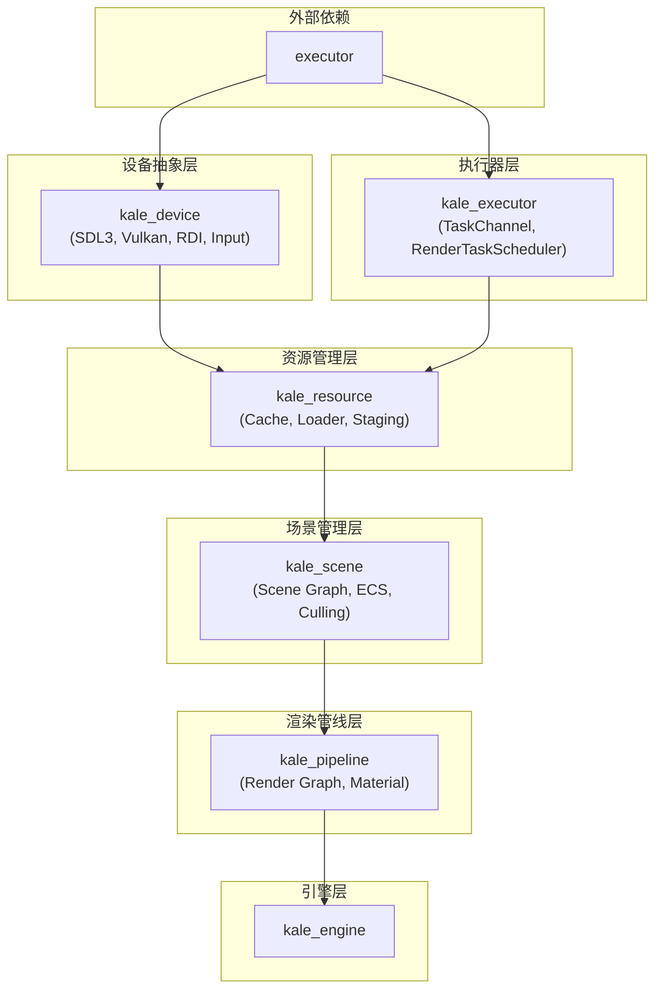

# Kale 项目开发流程总览

> 基于各层 todolist 及 [rendering_engine_design.md](../design/rendering_engine_design.md) 架构设计，梳理全项目开发顺序与依赖关系。

## 模块依赖关系（README 定义）

```
kale_device     (无依赖 - 最底层)
kale_executor   → executor（外部库）
kale_resource   → kale_device, kale_executor
kale_scene      → kale_device, kale_executor, kale_resource
kale_pipeline   → kale_device, kale_executor, kale_resource, kale_scene
kale_engine     → 所有上述模块
```

---

## 开发顺序总览（按阶段）

以下顺序保证：**被依赖项先于依赖项完成**；同阶段内可并行推进。

### 阶段 0：前置条件

| 序号 | 任务 | 所在 todolist | 说明 |
|-----|------|---------------|------|
| 0.1 | 集成 executor 库 | executor_layer | `find_package(executor)` 或 `add_subdirectory` |
| 0.2 | 集成 SDL3 | device_abstraction_layer | 窗口与输入依赖 |

---

### 阶段 1：设备层 + 执行器层基础（可并行）

| 序号 | 任务 | 所在 todolist | 依赖 |
|-----|------|---------------|------|
| 1.1 | SDL3 与窗口系统 (1.1) | device_abstraction_layer | 0.2 |
| 1.2 | Vulkan 基础 (1.2) | device_abstraction_layer | 1.1 |
| 1.3 | 简单三角形渲染 (1.3) | device_abstraction_layer | 1.2 |
| 1.4 | 输入系统基础 (1.4) | device_abstraction_layer | 1.1 |
| 1.5 | TaskChannel 核心实现 (1.1) | executor_layer | 0.1 |
| 1.6 | TaskChannel 扩展与测试 (1.2) | executor_layer | 1.5 |
| 1.7 | ExecutorPromise / ExecutorFuture (2.1) | executor_layer | 0.1 |
| 1.8 | then 续接 (2.2) | executor_layer | 1.7 |
| 1.9 | async_load API (2.3) | executor_layer | 1.7 |

---

### 阶段 2：RDI 完整实现

| 序号 | 任务 | 所在 todolist | 依赖 |
|-----|------|---------------|------|
| 2.1 | 资源句柄与描述符类型 (2.1) | device_abstraction_layer | 1.3 |
| 2.2 | IRenderDevice 接口定义 (2.2) | device_abstraction_layer | 2.1 |
| 2.3 | CommandList 接口 (2.3) | device_abstraction_layer | 2.2 |
| 2.4 | Vulkan Backend 资源 (2.4) | device_abstraction_layer | 2.2 |
| 2.5 | Vulkan Backend 命令与同步 (2.5) | device_abstraction_layer | 2.3, 2.4 |
| 2.6 | Vulkan Swapchain 与呈现 (2.6) | device_abstraction_layer | 2.5 |
| 2.7 | DataSlot 与 TaskDataManager (3.1) | executor_layer | 1.5 |
| 2.8 | TaskGraph (3.2) | executor_layer | 2.7 |
| 2.9 | submit_task_graph (3.3) | executor_layer | 2.8 |
| 2.10 | FrameData 与 SwapBuffer (4.1–4.2) | executor_layer | 1.5 |

---

### 阶段 3：资源管理层基础

| 序号 | 任务 | 所在 todolist | 依赖 |
|-----|------|---------------|------|
| 3.1 | 资源句柄类型 (1.1) | resource_management_layer | 2.1 |
| 3.2 | ResourceCache 基础 (1.2) | resource_management_layer | 3.1 |
| 3.3 | IResourceLoader 接口 (1.3) | resource_management_layer | 2.2 |
| 3.4 | ResourceManager 接口与 Loader 注册 (1.4) | resource_management_layer | 2.2, 3.2 |
| 3.5 | 同步 Load 实现 (1.5) | resource_management_layer | 3.4 |
| 3.6 | Mesh / Texture 数据结构 (1.8) | resource_management_layer | 2.1 |
| 3.7 | 简单 TextureLoader (1.6) | resource_management_layer | 3.3, 2.4 |
| 3.8 | 简单 ModelLoader (1.7) | resource_management_layer | 3.3, 2.4, 3.6 |

---

### 阶段 4：RenderTaskScheduler 与资源异步

| 序号 | 任务 | 所在 todolist | 依赖 |
|-----|------|---------------|------|
| 4.1 | RenderTaskScheduler 扩展 (5.1) | executor_layer | 2.8, 2.9 |
| 4.2 | 新扩展接口 (5.2) | executor_layer | 4.1 |
| 4.3 | LoadAsync 与 executor 集成 (2.1) | resource_management_layer | 4.1, 3.5 |
| 4.4 | Future 返回与回调 (2.2) | resource_management_layer | 4.3 |
| 4.5 | 占位符系统 (2.3) | resource_management_layer | 3.2 |
| 4.6 | Draw 时资源检查与触发加载 (2.4) | resource_management_layer | 4.3 |

---

### 阶段 5：场景管理层基础

| 序号 | 任务 | 所在 todolist | 依赖 |
|-----|------|---------------|------|
| 5.1 | 句柄与类型定义 (1.1) | scene_management_layer | - |
| 5.2 | SceneNode 核心 (1.2) | scene_management_layer | 5.1 |
| 5.3 | SceneManager 生命周期 (1.3) | scene_management_layer | 5.2 |
| 5.4 | 世界矩阵计算 (1.4) | scene_management_layer | 5.3 |
| 5.5 | Pass 标志 (1.5) | scene_management_layer | 5.2 |
| 5.6 | Renderable 挂载 (1.6) | scene_management_layer | 5.2 |
| 5.7 | BoundingBox 与数学 (2.1) | scene_management_layer | 3.6 |
| 5.8 | 视锥剔除 (2.2) | scene_management_layer | 5.7 |
| 5.9 | CullScene 单相机 (2.3) | scene_management_layer | 5.4, 5.8 |
| 5.10 | Renderable 抽象 (2.4) | scene_management_layer | 3.6, 5.6 |

---

### 阶段 6：Staging 与渲染管线基础

| 序号 | 任务 | 所在 todolist | 依赖 |
|-----|------|---------------|------|
| 6.1 | StagingMemoryManager (3.1–3.2) | resource_management_layer | 2.2 |
| 6.2 | Upload Queue 与 Copy 命令 (3.3) | resource_management_layer | 6.1 |
| 6.3 | TextureLoader 集成 Staging (3.4) | resource_management_layer | 6.2, 3.7 |
| 6.4 | ModelLoader 集成 Staging (3.5) | resource_management_layer | 6.2, 3.8 |
| 6.5 | SubmittedDraw 与 RenderPassContext (1.1) | rendering_pipeline_layer | 5.10 |
| 6.6 | PassFlags 与 RG 资源句柄 (1.2) | rendering_pipeline_layer | 5.5 |
| 6.7 | RenderPassBuilder (1.3) | rendering_pipeline_layer | 6.6 |
| 6.8 | RenderGraph 声明式接口 (1.4) | rendering_pipeline_layer | 6.7 |
| 6.9 | 应用层显式提交 (1.5) | rendering_pipeline_layer | 6.8 |
| 6.10 | Compile 流程 (1.6) | rendering_pipeline_layer | 6.8, 2.2 |
| 6.11 | Execute 流程单线程 (1.7) | rendering_pipeline_layer | 6.10, 2.6 |
| 6.12 | 简单 Forward Pass (1.8) | rendering_pipeline_layer | 6.11 |

---

### 阶段 7：ECS 与材质系统

| 序号 | 任务 | 所在 todolist | 依赖 |
|-----|------|---------------|------|
| 7.1 | SceneNodeRef 桥接 (3.1) | scene_management_layer | 5.3 |
| 7.2 | Entity 与 ComponentStorage (3.2) | scene_management_layer | - |
| 7.3 | EntityManager (3.3) | scene_management_layer | 7.2, 4.1 |
| 7.4 | System 基类 (3.4) | scene_management_layer | 7.3 |
| 7.5 | 与 executor 集成 (3.5) | scene_management_layer | 7.4, 4.1 |
| 7.6 | 写回流程示例 (3.6) | scene_management_layer | 7.5 |
| 7.7 | Material 基类 (2.1) | rendering_pipeline_layer | 6.10 |
| 7.8 | 材质级 DescriptorSet (2.2) | rendering_pipeline_layer | 7.7, 2.4 |
| 7.9 | 实例级 DescriptorSet 池化 (2.3) | rendering_pipeline_layer | 7.8 |
| 7.10 | ReleaseFrameResources (2.4) | rendering_pipeline_layer | 7.9, 6.11 |
| 7.11 | PBRMaterial (2.5) | rendering_pipeline_layer | 7.7 |
| 7.12 | Renderable::Draw 与 Material 绑定 (2.6) | rendering_pipeline_layer | 7.9, 5.10 |

---

### 阶段 8：完整资源加载与 Deferred 管线

| 序号 | 任务 | 所在 todolist | 依赖 |
|-----|------|---------------|------|
| 8.1 | 完整 ModelLoader (4.1) | resource_management_layer | 3.8, 6.4 |
| 8.2 | MaterialLoader (4.2) | resource_management_layer | 3.4, 7.7 |
| 8.3 | ShaderCompiler (4.3) | resource_management_layer | 2.2 |
| 8.4 | Shadow Pass (3.1) | rendering_pipeline_layer | 6.11, 7.12 |
| 8.5 | GBuffer Pass (3.2) | rendering_pipeline_layer | 8.4 |
| 8.6 | Lighting Pass (3.3) | rendering_pipeline_layer | 8.5 |
| 8.7 | Post-Process Pass (3.4) | rendering_pipeline_layer | 8.6 |
| 8.8 | OutputToSwapchain Pass (3.5) | rendering_pipeline_layer | 8.7 |
| 8.9 | SetupRenderGraph 示例 (3.6) | rendering_pipeline_layer | 8.4–8.8 |

---

### 阶段 9：多线程与优化

| 序号 | 任务 | 所在 todolist | 依赖 |
|-----|------|---------------|------|
| 9.1 | Vulkan 多线程 CommandPool (5.1) | device_abstraction_layer | 2.5 |
| 9.2 | DescriptorSet 池化 (5.2) | device_abstraction_layer | 7.9 |
| 9.3 | 帧流水线完善 (5.3) | device_abstraction_layer | 2.6 |
| 9.4 | Pass DAG 拓扑序分组 (4.1) | rendering_pipeline_layer | 8.9 |
| 9.5 | 多线程命令录制 (4.2) | rendering_pipeline_layer | 9.1, 4.1 |
| 9.6 | Vulkan 多线程录制约束 (4.3) | rendering_pipeline_layer | 9.5 |
| 9.7 | Render Graph 并行录制集成 (5.5) | executor_layer | 9.5 |
| 9.8 | 资源管理集成 (5.3) | executor_layer | 4.1, 4.3 |
| 9.9 | ECS 并行系统集成 (5.4) | executor_layer | 7.5 |

---

### 阶段 10：Camera、LOD 与高级特性

| 序号 | 任务 | 所在 todolist | 依赖 |
|-----|------|---------------|------|
| 10.1 | CameraNode (4.1) | scene_management_layer | 5.2 |
| 10.2 | CullScene 多相机 (4.2) | scene_management_layer | 10.1, 5.9 |
| 10.3 | 多视口支持 (4.3) | scene_management_layer | 10.2 |
| 10.4 | 工厂函数 (4.4) | scene_management_layer | 5.10 |
| 10.5 | LOD Manager 集成 (5.1) | scene_management_layer | 5.9, 3.6 |
| 10.6 | GPU Instancing (4.4) | rendering_pipeline_layer | 7.12 |
| 10.7 | Transparent Pass (5.4) | rendering_pipeline_layer | 8.9 |
| 10.8 | Shader Manager (5.1) | rendering_pipeline_layer | 8.3 |
| 10.9 | 着色器热重载集成 (5.2) | rendering_pipeline_layer | 10.8 |

---

### 阶段 11：设备层完善与引擎集成

| 序号 | 任务 | 所在 todolist | 依赖 |
|-----|------|---------------|------|
| 11.1 | 窗口 Resize 与 Swapchain (4.1) | device_abstraction_layer | 2.6 |
| 11.2 | 手柄支持 (4.2) | device_abstraction_layer | 1.4 |
| 11.3 | Action Mapping (4.3) | device_abstraction_layer | 11.2 |
| 11.4 | 输入事件回调 (4.4) | device_abstraction_layer | 1.4 |
| 11.5 | 输入状态双缓冲 (4.5) | device_abstraction_layer | 1.4 |
| 11.6 | OpenGL 后端 (Phase 3) | device_abstraction_layer | 2.2 |
| 11.7 | 设备能力查询 (5.4) | device_abstraction_layer | 2.2 |
| 11.8 | RenderEngine 初始化顺序 | device / executor / resource / scene / pipeline | 全部各层 |
| 11.9 | 主循环 Run() | kale_engine | 11.8 |

---

### 阶段 12：热重载与收尾

| 序号 | 任务 | 所在 todolist | 依赖 |
|-----|------|---------------|------|
| 12.1 | 文件变化侦测 (5.1) | resource_management_layer | 4.3 |
| 12.2 | 热重载流程 (5.2) | resource_management_layer | 12.1 |
| 12.3 | 引用计数与延迟释放 (5.3) | resource_management_layer | 3.2 |
| 12.4 | 预加载与批量加载 (5.4) | resource_management_layer | 4.3 |
| 12.5 | 压缩纹理支持 (4.4) | resource_management_layer | 3.7 |
| 12.6 | 多相机/多视口 (5.3) | rendering_pipeline_layer | 10.2 |
| 12.7 | 多光源 Shadow Pass (5.5) | rendering_pipeline_layer | 8.4 |
| 12.8 | 遮挡剔除 (5.2) | scene_management_layer | 5.9 |
| 12.9 | 场景切换与悬空引用 (5.3) | scene_management_layer | 7.6 |

---

## 依赖关系图（简化）



---

## 关键跨层依赖摘要

| 上层需求 | 下层提供 |
|----------|----------|
| ResourceManager Load / LoadAsync | IRenderDevice, RenderTaskScheduler |
| StagingMemoryManager | IRenderDevice |
| SceneManager CullScene | BoundingBox (resource), Renderable |
| RenderGraph Compile / Execute | IRenderDevice, Material, Texture, Shader |
| RenderGraph 并行录制 | BeginCommandList(threadIndex), RenderTaskScheduler |
| EntityManager Update | RenderTaskScheduler, SceneManager |
| Renderable::Draw | Material, Mesh, IRenderDevice CommandList |
| MaterialLoader | ResourceManager (Load Texture), IRenderDevice |

---

## 参考文档

- [device_abstraction_layer_todolist.md](device_abstraction_layer_todolist.md)
- [executor_layer_todolist.md](executor_layer_todolist.md)
- [resource_management_layer_todolist.md](resource_management_layer_todolist.md)
- [scene_management_layer_todolist.md](scene_management_layer_todolist.md)
- [rendering_pipeline_layer_todolist.md](rendering_pipeline_layer_todolist.md)
- [rendering_engine_design.md](../design/rendering_engine_design.md)
